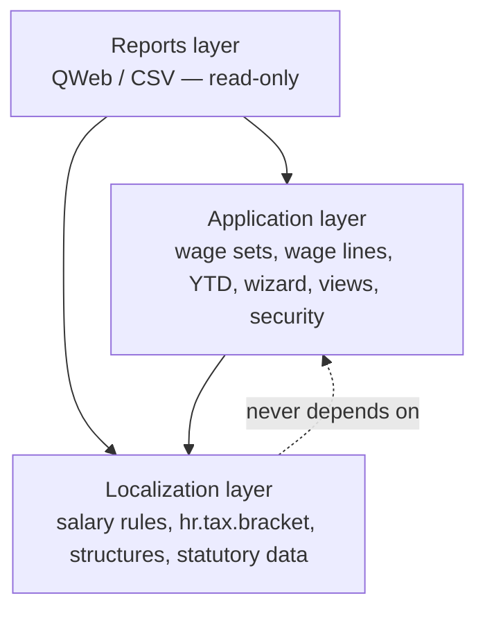
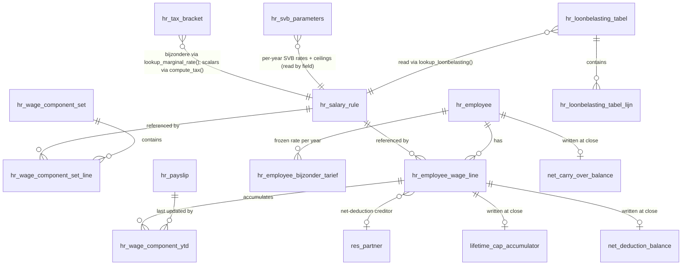
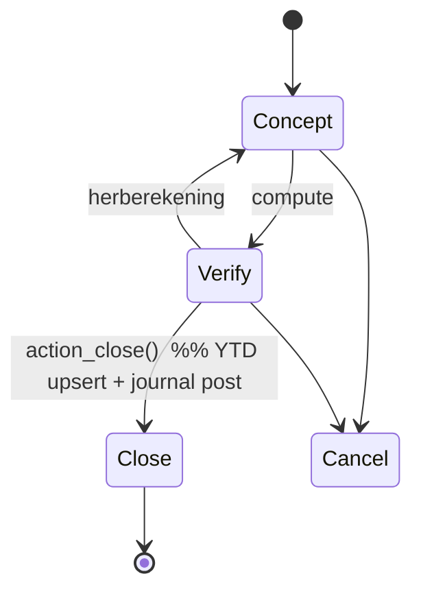

::: {custom-style="Title"}
l10n_cw_hr_payroll — Architecture Spine
:::
::: {custom-style="Subtitle"}
Curaçao Payroll Localization for Odoo 19 Enterprise — build-time consistency contract
:::

# Architecture Spine — l10n_cw_hr_payroll

The build-time consistency contract for the module. It fixes only the invariants that keep ~21 salary
rules, the data files, the custom models, and the reports from diverging. Everything structural — the
stack, the file tree, the field-level shape of each model, the full sequence map — is **seed**: settled
by Tech Design v3.0D and owned by the code once it exists. For that detail, read the tech design; this
spine does not mirror it.

## Design Paradigm

**Odoo Enterprise localization module** following the official `l10n_*_hr_payroll` pattern (analogous to
`l10n_be_hr_payroll`), layered on the native `hr_payroll` engine. The calculation core is a
**sequential salary-rule pipeline**: each `hr.salary.rule` is a filter that reads a shared payslip
context (`employee`, `version` — the `hr.version` record, Odoo 19's successor of the v3.0D `contract` —, `payslip`, `categories`, `rules`, `inputs`, `worked_days`, `env`) and
assigns `result`, in strict ascending sequence. Statutory values are **data, not code** — held in dated
records and read at runtime. Three layers map to directories:

| Layer | Owns | Directories |
| --- | --- | --- |
| Localization | Statutory definitions + dated data | `models/hr_salary_rule.py`, `models/hr_tax_bracket.py`, `models/hr_loonbelasting_tabel.py`, `models/hr_svb_parameters.py`, `models/hr_version.py` (Odoo 19: `hr.version` replaces `hr.contract` — decided 2026-07-07), `models/hr_employee.py`, `data/`, salary-rule Python |
| Application | Config + workflow + UI + security | `models/hr_wage_component_set.py`, `models/hr_employee_wage_line.py`, `models/hr_wage_component_ytd.py`, `models/hr_employee_bijzonder_tarief.py`, the close-time state of AD-29 (net carry-over balance, net-deduction balances, lifetime cumulative-cap accumulators, year lock — model names left to the stories; added 2026-10-08), `wizard/`, `views/`, `security/` |
| Reports | Read-only rendering | `report/` |

## Invariants & Rules

Dependency direction (a rule, not just a picture — arrows = "may depend on"):



### AD-1 — Sign convention `[ADOPTED]`

- **Binds:** all salary rules.
- **Prevents:** `NET` miscomputing when an author returns a positive deduction.
- **Rule:** employee deductions and employee premiums return **negative** amounts; employer costs and
  income-base intermediates return positive. `NET` sums categories directly and relies on this.

### AD-2 — Category-assignment contract `[ADOPTED]`

- **Binds:** every rule's `category_id`.
- **Prevents:** an employer cost landing in `DED`, or an allowance outside `ALW`, silently breaking
  `NET` while every other rule is obeyed.
- **Rule:** `NET = BASIC + ALW + DED` (DED negative). Employer contributions go to `ER` and are
  **excluded** from `NET`. All overtime contributes to `ALW`.
- **Untaxed earnings are `ALW` with a flag, not a category** *(decided 2026-10-08, superseding the
  separate post-`NET` onbelaste-vergoedingen line at Seq 140 in its own category, paid as `NET` + that
  line)*. An untaxed (art. 6F lid 1 LLB) earning is an `ALW` earning carrying `is_untaxed` (AD-27), so it
  is inside `NET` and the identity above still holds; expense reimbursements are untaxed earnings. The
  former Seq 140 line is **removed**; the amount paid to the employee is the final `NET` (after net
  deductions and carry-over, AD-28/AD-29).
- **BVZ supplement inside `NET`** *(decided 2026-10-08, superseding BVZ employer premium in `ER` and BVZ
  employee premium as the employee share)*. The whole BVZ premium is legally the employee's premium: the
  employer **supplement** **leaves `ER`** and is paid to the employee inside `NET`: `BVZ_SUPPL` is an
  `ALW` earning flagged `is_untaxed` per AD-27. **The supplement is not wage** (art. 6F lid 1 sub l LLB):
  it is untaxed and outside every premium base (AOV/AWW, BVZ, AVBZ, ZV/OV), also under supplement type
  `full`. `BVZ_SUPPL` holds the **whole** supplement — the statutory 9.3 % / 2.8 %, the full premium
  under `full`, or 0 under `none` *(decided 2026-10-09, OQ-14, superseding "flagged `is_untaxed`
  provisionally, pending OQ-14" and the separate `BVZ_SUPPL_EXTRA` line, Seq 31, for the part above the
  statutory supplement under `full`, which is removed)*. The **total** BVZ premium
  (`BVZ_TOTAL`) is one `DED` line (negative). Net effect: the
  employee bears only their share. `TOTAL_ER_COST` (Seq 150) still **includes** `BVZ_SUPPL`
  (employer cost) even though it is no longer in `ER`.
- **Net-deduction stage** *(added 2026-10-08)*: `NET_PRE` (Seq 125, hidden) = net before net deductions;
  `NET_DED` (Seq 126, `DED`, negative) = the net deductions (AD-28); `NET_CARRY` (Seq 128) = carry-over in
  and out (AD-29); `NET` (Seq 130) is the final net pay. Net deductions and carry-over never feed
  `TAX_INC` or a premium base. `NET_PRE` is a subtotal and sits **outside** `BASIC/ALW/DED`, so it is
  never summed into `NET`. The category of `NET_CARRY`, and how a positive carry-out squares with AD-1's
  sign convention, are **left to Story 2.17**; whatever is chosen, the final `NET` must still be the sum
  of its categories.
- **Wage in kind is not cash** *(added 2026-10-08)*. Bijtelling (natura-loon) wage lines are in
  `TOTAL_LOON`, so in gross, `TAX_INC` and the premium bases, but are not paid in cash, so they must
  **not raise cash net pay** — a matching non-cash offset is required. The offset's presentation (offset
  line vs separate category) is **open (OQ-20)**; this AD fixes only the requirement.

### AD-3 — Strict sequence + reference discipline `[ADOPTED]`

- **Binds:** all salary rules.
- **Prevents:** two authors reordering or forward-referencing and producing different results.
- **Rule:** rules evaluate in fixed ascending `sequence` (10–150). A rule may reference only **prior**
  results, via `rules.CODE.amount` and `categories.X` — never a later rule. Hidden intermediates carry
  `appears_on_payslip = False`.

### AD-4 — Annualisation convention `[ADOPTED]`

- **Binds:** every rule applying a statutory ceiling, threshold, or bracket.
- **Prevents:** one author applying an annual ceiling directly to a monthly figure.
- **Rule:** periodic (monthly) base × 12 → apply the annual ceiling/scale/bracket → ÷ 12 back to
  periodic.
- **Exception — loonbelasting:** the `lb-*tabel` is already period-specific (monthly table → monthly
  result directly). LOONBEL_RAW (Seq 90) calls `lookup_loonbelasting` with the raw monthly `TAX_INC`
  and receives a monthly tax amount — no × 12 / ÷ 12. See AD-20.
- **Superseded for SVB ceilings — monthly maximum, BVZ running total** *(decided 2026-10-08,
  superseding "for the annual SVB ceilings (AOV/AWW, BVZ, AVBZ) the binding method is the cumulative
  annual-maximum of AD-24")*. The per-month ×12/÷12 here governs no production premium path:
  - **AOV/AWW** (incl. the 1 % surcharge) and **AVBZ** use a strict **monthly maximum** = annual ceiling
    ÷ 12 (AOV/AWW 100 000 ÷ 12 = 8 333.33; AVBZ 606 247.08 ÷ 12 = 50 520.59), applied to the month's base
    directly; each month stands alone. The 1 % surcharge is on the excess above the **monthly** cap.
    Differences against the annual ceiling are settled in the employee's annual assessment (AOV art.
    29–30; AVBZ art. 20 lid 2), not in payroll.
  - **AOV/AWW 1 % is the employee's own premium** *(decided 2026-10-09, OQ-17, superseding "who pays
    the 1 % is open")*: the 1 % above the monthly maximum is an employee premium (Lv AOV art. 26 lid 3);
    the employer's toeslag (Lv AOV art. 58) does not cover it and the employer pays no surcharge.
  - **No own AOV/AWW premium room for a bijzondere bonus** *(decided 2026-10-09, OQ-16, superseding
    "open (OQ-16)")*: a bonus taxed via the bijzondere-beloningen table falls in the AOV/AWW base of the
    month it is paid in and shares that month's maximum — the maximum applies per pay period
    (Gezamenlijke beschikking AOV/AWW en loonbelasting 1976, art. 6 lid 2) and the bonus belongs to the
    wage of the month it is paid in (LLB art. 8 lid 6).
  - **ZV/OV** use their published monthly cap (AD-22).
  - **BVZ only** uses the running total of **AD-24**.
  - The ×12/÷12 frame is retained only as the conceptual statement that a monthly figure is never
    compared with an annual ceiling unconverted.

### AD-5 — Dated-rate authority `[ADOPTED]` (resolves the rates fork)

- **Binds:** **all** statutory rates and ceilings — the SVB premiums (AOV/AWW, AVBZ, BVZ, ZV, OV) and
  their ceilings, the bijzondere-beloningen rates, the verwervingskosten forfeit, the basiskorting, and
  the toeslagen.
- **Prevents:** a rate change requiring a code deploy (the PRD regulatory-agility goal); two rules
  holding divergent copies of the same rate.
- **Rule:** **no statutory rate, ceiling, or threshold is a literal in rule Python** — every one is a
  **dated, append-only** data record (never deleted; superseded by setting `valid_to` and inserting a
  new `valid_from`), read at runtime. Three stores, by data shape:
  - **SVB premiums (rates + ceilings)** → one **per-year** `hr.svb.parameters` record (AD-22). The
    single source of truth for every SVB rate and ceiling.
  - **Loonbelasting** → the official `lb-*tabel` in `hr.loonbelasting.tabel` (AD-20). The Schijventarief
    (inkomstenbelasting bracket table) is **not** the withholding instrument and must not be used.
  - **Bijzondere beloningen + the Belastingdienst scalars** (basiskorting, verwervingskosten, toeslagen)
    → `hr.tax.bracket`, keyed by `tax_type` (`income_from`/`income_to`, `rate`, `valid_from`/`valid_to`;
    no payer field).
- **Read/representation contract** — so two authors encode and read identically:
  - *Marginal-rate lookup* (`bijzondere_beloning`, in `hr.tax.bracket`): one ordered set of dated band
    records; read via `lookup_marginal_rate(jaarloon, 'bijzondere_beloning', date)`, which returns the
    **single band rate** whose range contains `jaarloon` — band match is `income_from ≤ jaarloon <
    income_to` (matching the table's *"groter of gelijk aan … maar kleiner dan"*; `income_to = 0` = top
    band, uncapped) — it does **not** accumulate. EXTRA_TAX applies that one rate to the
    bijzondere-beloning amount (see AD-21).
  - *Dated scalar* (basiskorting, verwervingskosten, toeslagen, in `hr.tax.bracket`): a single dated
    value read by `compute_tax(tax_type, date)` (the one surviving caller of `compute_tax` after the
    SVB move) — a flat amount/rate, no band accumulation.
  - *SVB premium* (in `hr.svb.parameters`, AD-22): the rule reads the relevant rate and ceiling **field**
    from the year's record and applies the ceiling per AD-4/AD-24 — monthly cap (annual field ÷ 12, or
    the ZV/OV monthly field) for AOV/AWW, AVBZ, ZV, OV; running total for BVZ *(decided 2026-10-08,
    superseding "caps the annualised base at the ceiling, applies the rate, de-annualises")*. Per the
    official SVB 2026 table the employee shares are **flat** (BVZ 4.3 %, AVBZ 1.5 %, AOV+AWW 6.5 %); the
    AOV surcharge is 1 % on the base **above** the monthly AOV/AWW cap (computed as
    `rate × max(0, base − monthly cap)`, never the whole base). There are **no** income-graduated employee
    scales.
  - Data records hold **only** rates, ceilings, and band bounds — never the arithmetic, which stays in
    the rule per AD-4.
- **Note:** this overrides the v3.0D rule listings, which hardcode premium literals
  (9.3 %, 6.5/9.5 %, 150 000, 100 000, 606 247.08, 41.67). **The official Belastingdienst (loonbelasting)
  and SVB (premiums) annual publications are authoritative**; any rate, ceiling, or scale in the v3.0D
  tech design is indicative only and is superseded by them. Per the SVB 2026 table the v3.0D "sliding
  scales" (BVZ 0–4.3 % bands; AVBZ 29 897.44 threshold) **do not exist** — BVZ and AVBZ employee shares
  are flat with a ceiling. *(This Rule supersedes the earlier per-`tax_type` SVB split: the granular SVB
  `tax_type` values moved to `hr.svb.parameters` in AD-22; `hr.tax.bracket` keeps `bijzondere_beloning`
  and the Belastingdienst scalars.)*

### AD-6 — Enable/disable gate + never-gate set `[ADOPTED]`

- **Binds:** all premium/tax computation rules and the eight shared intermediates.
- **Prevents:** gating a shared base (e.g. `AOV_PREM_INC`) and silently breaking AVBZ for an
  AOV-exempt employee.
- **Rule:** each premium/tax rule checks its `hr.employee.wage.line.enabled`; if `False` → `result =
  0.00`, skip logic (downstream receives `0.00`, never an error or stale value). The **never-gate set
  always executes** regardless of any flag: `BVZ_PREM_INC` (20), `AOV_PREM_INC` (50), `TAX_INC` (80),
  `LOONBEL_RAW` (90), `NET_PRE` (125), `NET_CARRY` (128), `NET` (130), `TOTAL_ER_COST` (150).
  *(decided 2026-10-08, superseding the six-rule set: `NET_PRE`, the net before net deductions, and
  `NET_CARRY`, the automatic net carry-over of AD-29, are shared bases/outputs and are never gated.)*
- **BVZ exempt is the per-year gate for BVZ** *(added 2026-10-08)*: the employee's BVZ-exempt switch is
  the existing `enabled` gate, set per tax year, and overrides the AOV-insured status and the supplement
  type (AD-24). AOV/AWW liability follows the employee's AOV-insured status with its own AOV/AWW
  override (AD-22).

### AD-7 — `active` vs `enabled` semantic split `[ADOPTED]`

- **Binds:** `hr.employee.wage.line`.
- **Prevents:** conflating UI visibility with calculation participation; losing the audit trail of a
  deliberate exemption.
- **Rule:** `active = False` hides the line **and** excludes it from calculation; `enabled = False`
  keeps it **visible** for audit but returns `0.00`. Independent. A statutory exemption is
  `active = True, enabled = False`.

### AD-8 — Three-tier decoupling `[ADOPTED]`

- **Binds:** `hr.salary.rule` (T1) → `hr.wage.component.set` (T2) → `hr.employee.wage.line` (T3).
- **Prevents:** a template edit retroactively mutating live employee payroll; ambiguous ownership of a
  wage line.
- **Rule:** applying a T2 set is a **one-time copy** via `hr.wage.set.apply.wizard` that creates
  independent T3 records; later T2 edits do **not** propagate. `T3.salary_rule_id` is read-only after
  creation. After apply, T3 is the sole owner of its values.

### AD-9 — Single state-commit point `[ADOPTED]`

- **Binds:** `hr.payslip.run.action_close()`.
- **Prevents:** double-counted YTD or duplicate/unbalanced journal postings from a second mutation path.
- **Rule:** `action_close()` is the **only** place results are committed, in order: confirm + lock
  payslips → upsert `hr.wage.component.ytd` → upsert the per-(employee, year) bijzondere-beloningen
  tarief record (AD-21) → post the `account.move` (draft → posted) → expose run reports. `ytd`, the
  tarief record, and the journal are mutated nowhere else. Recompute (herberekening) is permitted only
  **before** close.
- **Idempotent close (PRD allows reopening a closed run).** `hr.wage.component.ytd` holds a single
  scalar `ytd_amount` per (employee, rule, year), so close must **recompute** it, not blindly
  increment: on close, `ytd_amount` is set to the **sum over that year's confirmed payslip lines** for
  the (employee, rule) — making the value a pure function of the confirmed payslips and identical no
  matter how many times the run is closed. `last_updated`/`last_payslip_id` record the most recent
  close. Reopening a run **reverses** its posted `account.move`. **Prevents:** double-counted YTD and
  duplicate journal postings on reopen → re-close.
- **New close-time state — committed only here** *(decided 2026-10-08, extending the commit list)*.
  `action_close()` is also the **only** place that mutates: the per-employee **net carry-over balance**
  (AD-29); the **net-deduction balances** ("deduct from balance", AD-28); the **lifetime cumulative-cap
  accumulators** per wage line (AD-26); the **one-time resets** (one-time wage lines set to 0, AD-25);
  the **beschikkingsaftrek zeroing** at year close (AD-29); and the **year lock** (AD-29). Rules may
  **read** these values during evaluation but never write them (see Conventions).
- **Reversibility + idempotence of the new state** *(added 2026-10-08)*. The controlled reopen (Story
  3.5) **must reverse every one** of these mutations made by a monthly close of an **unlocked year**,
  and a re-close must reproduce them exactly — the same idempotence YTD has. A one-time reset overwrites
  a Tier-3 value, so close must preserve what it needs to restore it (or derive it from the confirmed
  payslips, as YTD is). The mechanism is left to Story 3.5; reversibility is the invariant. The
  year-close mutations (year lock, beschikkingsaftrek zeroing, year-end actions) are undone only by the
  restore below, never by the controlled reopen *(derived from D18, 2026-10-08)*.
- **A locked year cannot be reopened inside the module** *(decided 2026-10-08, superseding "a locked
  year can be reopened only by the explicit controlled reopen; how strict that is (who, which
  confirmation) is decided in the story")*. The only way is to **restore the Odoo.sh backup taken
  before the last payroll run of that year** and redo that run. The year-close confirmation therefore
  tells the user to make that backup first *(derived from the procedure)*. If the payroll manager has
  already entered a **new licence** after the year close, the restore is allowed only with permission of
  the provider of this payroll module; the licence mechanism and how that permission is given and
  recorded are open (**OQ-23**) — no licence model is specified here.
- **Reopen of an unlocked year is the controlled in-app path — not a database restore** *(amended
  2026-10-08, superseding "the controlled reopen … is the only reopen mechanism" and "a whole-database
  restore is … disaster-only … never the routine reopen" for a locked year)*. For monthly runs of an
  unlocked year, the controlled reopen above (reverse journal + recompute) is the **only** reopen
  mechanism the module provides. The module never performs a database restore: Odoo.sh offers only
  whole-DB backup/restore (no partial restore), which would roll back every user's unrelated work, so a
  restore is a coordinated operational measure — the sanctioned procedure for a locked year (above) and
  otherwise disaster-only. A **pre-close manual Odoo.sh backup** is the recommended operational safety
  step before a monthly close and the **required** step before the last run of the year (an Odoo.sh
  dashboard action, not a module feature); destructive source-data mutations are otherwise tested in an
  Odoo.sh **Staging** branch, not on production. A custom application-level payroll snapshot/restore is
  **out of scope for v1.0R** (see Deferred).

### AD-10 — Accounting balance by construction `[ADOPTED]`

- **Binds:** the journal posted at close.
- **Prevents:** an unbalanced `account.move`; treating placeholder GL numbers as fixed.
- **Rule:** every employer-cost debit has a matching payable credit; total debit ≡ total credit by the
  NET identity (`total loon = net + all employee deductions`). GL account numbers are indicative,
  mapped to the company chart at onboarding — not requirements.
- **Net deductions, carry-over and BVZ supplement** *(decided 2026-10-08, extending the rule above)*:
  - **Net deductions** (AD-28): each line credits its own GL account as a **payable to its creditor**
    (`res.partner` on the wage line). They are part of "all employee deductions" in the identity.
  - **Net carry-over** (AD-29): a shortfall carried to the next payroll is booked as a **receivable from
    the employee**; collecting it next period clears that receivable. Tax and premiums are posted in
    full (art. 11 lid 4 LLB).
  - **BVZ supplement** (AD-2, AD-24): `BVZ_SUPPL` is an **employer cost**, debited **exactly
    once** — it is excluded from the gross-wage expense debit even though it now sits in `ALW`, so
    the move does not double-count it. There is no separate debit for a part above the statutory
    supplement *(decided 2026-10-09, OQ-14, superseding the separate `BVZ_SUPPL_EXTRA` line)*. The **SVB payable** is
    the **total** BVZ premium (`BVZ_TOTAL`). Which GL account carries the supplement is open with the rest of OQ-05.
  - **Balance identity (updated):** gross wage (incl. untaxed earnings, the BVZ supplement, and the
    non-cash Bijtelling offset whose presentation is open in OQ-20) = cash
    net paid + Σ employee deductions (tax, premiums incl. `BVZ_TOTAL`, net deductions) − carry-over
    receivable change; the employer side debits each employer cost once against its payable. Debit ≡
    credit still follows by construction.
  - **Corrections** (AD-30) are ordinary lines on the current payslip and post with it; closed periods'
    moves are never altered.

### AD-11 — Layer boundaries + dependency direction `[ADOPTED]`

- **Binds:** module package layout (see diagram above).
- **Prevents:** a report recomputing tax (a second source of truth); the localization layer depending
  on application/report code.
- **Rule:** dependencies point **inward** toward Localization. Reports read computed data and render
  only — they never compute a statutory amount. Localization never imports Application or Reports.

### AD-12 — Money & rounding discipline `[ADOPTED]`

- **Binds:** tax/premium rule outputs, `compute_tax`, `lookup_loonbelasting`, the journal, and the
  declaration reports.
- **Prevents:** accumulated rounding drift; toeslagen mis-modeled as taxable-income reductions; a
  declaration showing decimals, or the journal being truncated to whole units.
- **Rule:** currency is XCG; `compute_tax` and `lookup_loonbelasting` both return `round(x, 2)`;
  acceptance tolerance is XCG 0.02 (rounding only). `lookup_loonbelasting` returns the **raw**
  loonbelasting from the table **before** toeslagen; toeslagen are then applied as **monetary
  deductions from the tax amount** (not income reductions), floored at 0.
- **Presentation rounding (declarations vs journal):** the calculation engine, payslips, and the
  journal (`account.move`) keep the **actual 2-decimal amounts**. **Tax returns / declarations (B-01,
  B-02) present whole XCG** — decimals are **dropped (truncated), not rounded**. This is a Reports-layer
  presentation rule (AD-11) applied to already-computed amounts; it never alters the engine or journal
  values.

### AD-13 — Statutory defaults applied unconditionally `[ASSUMPTION]`

- **Binds:** verwervingskosten forfeit and basiskorting.
- **Prevents:** an inconsistent baseline across employees; a basiskorting double-count.
- **Rule:** verwervingskosten (XCG 41.67/mo — the statutory forfeit, max XCG 500/yr) and basiskorting
  (XCG 2 915/yr = XCG 242.92/mo — the official 2026 figure on the Belastingdienst *Loonbelastingverklaring
  2026*, AD-5) apply automatically to **all** employees for v1.0R (Option A). A per-employee disable is a
  deferred change request (PRD A-06 / OQ-02). *(Correction 2026-06-28: the earlier 3 247.35 was an
  inkomstenbelasting figure, not the loonbelasting withholding basiskorting; the Loonbelastingverklaring
  2026 states 2 915/yr. The v3.0D 2 915 was therefore correct, not a prior-year value.)*
- **No double-count — the maandtabel is *exclusief basiskorting*.** The 2026 `lb-maandtabel` is published
  **exclusief basiskorting** (it taxes from the first gulden), so basiskorting is **not** already in
  `LOONBEL_RAW`; it is a **live, required** separate deduction applied **after** the table lookup
  (Seq 100, as a monetary deduction from the tax amount per AD-12), floored at 0. This is what consumes
  the basiskorting scalar read via `compute_tax` (AD-5).
- **`[RESOLVED 2026-06-28]` Application point — verwervingskosten vs basiskorting.** Confirmed against the
  official Belastingdienst *Loonbelastingverklaring 2026* and source guidance: the two are distinct
  instruments at distinct sequence points. **Verwervingskosten is an income deduction (aftrekpost)** —
  it reduces the taxable wage `TAX_INC` **pre-table (Seq 80)**; **basiskorting and the toeslagen are tax
  credits (heffingskortingen)** — they reduce the computed tax amount **post-table (Seq 100, AD-12)**,
  floored at 0. Verwervingskosten touches **only** `TAX_INC` (never the SVB premie-loon base, AD-14).
  The earlier "lumps both as post-table deductions" risk is closed: they must **not** share a sequence
  point.

### AD-14 — Canonical premium-base derivation `[ADOPTED]`

- **Binds:** all premium income-base rules (`BVZ_PREM_INC`, `AOV_PREM_INC`), and the base the ZV and
  OV premium rules cap (rule code left to Story 2.10; added 2026-10-08).
- **Prevents:** BVZ and AOV diverging on whether overtime is in the base; ZV/OV being charged on
  overtime or missing wage in kind.
- **Rule:** premium bases derive from `categories.BASIC + categories.ALW` (**overtime included** via
  `ALW`), **not** from individual `rules.X` refs — so all bases stay mutually consistent. This fixes the
  v3.0D source contradiction in which `BVZ_PREM_INC` used `rules.TOTAL_LOON.amount` (excluding
  overtime): `BVZ_PREM_INC` must be refactored to the `categories.BASIC + categories.ALW` base.
- **Resolution:** overtime-in-base confirmed by the product owner (2026-06-26) — settles the prior open
  question.
- **Untaxed earnings are subtracted from the bases** *(decided 2026-10-08, extending the derivation)*:
  the `BVZ_PREM_INC` (Seq 20) and `AOV_PREM_INC` (Seq 50) bases subtract `ALW` earnings flagged
  `is_untaxed` (AD-27, incl. `BVZ_SUPPL`, which is not wage under art. 6F lid 1 sub l LLB and stays
  outside every premium base, ZV/OV included, also under supplement type `full`; decided 2026-10-09,
  OQ-14, superseding "provisionally pending OQ-14" and the open treatment of the removed
  `BVZ_SUPPL_EXTRA`), exactly as they subtract Lei di
  Bion-exempt overtime (AD-23). `TAX_INC` (Seq 80) subtracts them too. AOV/AWW, BVZ and AVBZ **always
  follow taxable wage** otherwise. Net deductions (AD-28) and the beschikkingsaftrek (AD-27) never touch
  a premium base.
- **"Include in SVB wage" affects ZV/OV only** *(decided 2026-10-08)*: the per-line flag (default ON
  for taxable earnings, default OFF for untaxed earnings) decides only whether an earning is in the ZV
  and OV base, which have their own wage definition. It **never** removes an earning from the AOV/AWW,
  BVZ or AVBZ base.
- **ZV/OV base** *(decided 2026-10-08, superseding PRD Step 12 "contract base wage (excluding fringe
  benefits)" and any reading of "overtime included via `ALW`" as covering ZV/OV)*. ZV wage is every
  payment for work "in welke vorm ook" (Lv Ziekteverzekering art. 1, art. 2 lid 2), so the ZV base =
  **contract wage + Bijtelling + earnings flagged "Include in SVB wage"**, capped at the monthly ZV/OV
  limit (AD-22). The "overtime included" rule above applies to AOV/AWW, BVZ and AVBZ only.
  - **Bijtelling is always in the ZV base**, at its LLB value unless the SVB or a ministerial
    regulation sets another valuation (art. 2 lid 5).
  - **Overtime is never in the ZV base**, with or without Lei di Bion: the "Include in SVB wage" flag is
    **fixed off** for every overtime earning type (`OVT_WD`, `OVT_SAT`, `OVT_SUN`, `OVT_PH`), including
    exempt (AD-23) and bijzondere-route (AD-21) overtime.
  - Generic taxable earnings follow their per-line flag (default on); untaxed earnings default off.
    `BVZ_SUPPL` is **never** in the ZV/OV base: the flag is fixed off for it (not wage, art. 6F lid 1
    sub l LLB; decided 2026-10-09, OQ-14, superseding its open treatment pending OQ-14).
  - **OV** uses the same base as ZV pending confirmation that the OV ordinance has the same wage
    definition (**OQ-22**, non-blocking).

### AD-15 — Default Odoo presentation (no custom theme) `[ADOPTED]`

- **Binds:** all module views and reports.
- **Prevents:** custom styling drifting from Odoo's own look, or leaking onto Odoo's standard and
  inherited pages.
- **Rule:** the module ships **no stylesheet**: no `static/src/scss` files, no manifest `assets` entry,
  no wrapper CSS class and no theme module dependency. Its own views and the inherited Odoo views render
  with Odoo 19's default look, in light and dark mode. *(Decided 2026-10-05 by the PO, superseding the
  scoped `cw_theme_prl10n` theme — in-module SCSS under a `.cw_theme_prl10n` wrapper, dark tokens in
  `web.assets_web_dark` — which Story 1.2 had implemented. Theming may be reconsidered later as a new
  decision; the superseded rule is recorded in `.memlog.md`.)* Presentation computes no statutory
  amount (AD-11).

### AD-16 — Senior-only payslip-distribution gate `[ADOPTED]`

- **Binds:** the payslip-distribution action on `hr.payslip.run` and the security groups.
- **Prevents:** payslips reaching employees before the run is final and verified — e.g. distribution
  while a reopen/correction is still possible, or by a non-senior user.
- **Rule:** distribution is a **separate, explicit action**, restricted to the **most senior existing
  role — the Payroll Manager group (`group_l10n_cw_payroll_manager`)**; no new group is added. It is
  allowed **only after** the run is closed (AD-9) **and** an explicit "no restore needed" confirmation.
  Closing a run does **not** distribute; distribution is a deliberate second step. The distribution
  **channel** (email / Employee Portal / app) is deferred (OQ-01) — this AD fixes only the *gate*, not
  the medium.

### AD-17 — Canonical effective date for dated lookups `[ADOPTED]`

- **Binds:** every dated-rate / bracket lookup, every `compute_tax` call, and every
  `lookup_loonbelasting` call in the calculation.
- **Prevents:** rules within one payslip reading rates from different effective dates; a historical
  recompute silently using *today's* rates (the v3.0D `compute_tax` defaults to `today()`).
- **Rule:** all dated lookups use **one canonical effective date — the payslip's period-end date**
  (`payslip.date_to`), passed explicitly to `compute_tax`, `lookup_loonbelasting`, and bracket
  searches. Neither method may fall back to `today()` in payroll context. Recomputing a historical
  payslip therefore reproduces the table and rates in force for its period (consistent with AD-5's and
  AD-20's append-only dated records).

### AD-18 — Fail loud on missing statutory data `[ADOPTED]`

- **Binds:** `compute_tax`, `lookup_loonbelasting`, and any required dated-rate lookup.
- **Prevents:** a missing rate/bracket/table silently yielding 0 → wrong, zero statutory tax/premium.
- **Rule:** if a **required** statutory rate, bracket, scale, or loonbelasting table entry is absent
  for the effective date, raise a **blocking error** (`UserError`, naming the `tax_type` or
  `period_type` and date) — **never return 0**. This is distinct from AD-6: a *disabled* premium
  deliberately returns 0; *missing statutory data* is a defect that must stop the run, not pass
  silently.
- **Carve-out (decided 2026-10-04):** the lb-tabel's one-year prior-year fallback (AD-20) is the only
  sanctioned carry-over of a previous year's statutory data. It returns real table values, never 0,
  and is not a general fallback for other lookups.

### AD-19 — Company scoping (multi-company-safe) `[ADOPTED]`

- **Binds:** every model's company scope and its record rules.
- **Prevents:** national rates being duplicated or diverging per company; operational payroll data
  leaking across companies.
- **Rule:** **National statutory data is global/shared** — `hr.tax.bracket`, `hr.loonbelasting.tabel`
  (+ `.lijn`), the CW salary rules and categories, and the `CWMONTHLY`/`CWSTAFF` structures carry no
  `company_id` (one Curaçao ruleset for all CW companies). **Operational data is company-scoped** via
  `company_id` with multi-company record rules — `hr.wage.component.set`(+line),
  `hr.employee.wage.line`, `hr.wage.component.ytd`, payslips / runs, and the journal. This holds
  whether an install is single- or multi-company; actual multi-company *enablement* remains an open
  question (kept cheap and safe by this scoping either way).

### AD-20 — Loonbelasting table model `[ADOPTED]` (2026-06-27)

- **Binds:** LOONBEL_RAW (Seq 90) and any future period-specific payroll rule.
- **Prevents:** using the Schijventarief (the annual *inkomstenbelasting* bracket table) as the
  loonbelasting withholding instrument — which is conceptually wrong; employers must use the published
  `lb-*tabel`. Also prevents annualizing a period-specific table.
- **Background:** Loonbelasting is a periodic *withholding* on wages only (a prepayment of
  inkomstenbelasting). Its statutory instrument is the `lb-*tabel` series published annually by the
  Minister of Financiën via Ministeriële Regeling (source: MR 144, 2024). The Schijventarief is the
  annual inkomstenbelasting table filed by taxpayers; it is not the employer's withholding instrument.
- **Rule:**
  - Loonbelasting is looked up in `hr.loonbelasting.tabel` (header) / `hr.loonbelasting.tabel.lijn`
    (rows): one row per `(tabel_id, wage_from)` where `wage_from` are the exact wage points in the
    published table.
  - **Header fields:** `name` (e.g. "Maandtabel 2026", "Maandtabel 2026 Correctie 1"),
    `period_type`, `year` (Integer, e.g. 2026), `valid_from`, `valid_to` (nullable), `active`,
    `above_ceiling_rate` (Float; the top marginal rate applied above the table ceiling — 46.5 % for
    2026).
  - **Selection rule** *(decided 2026-10-04, superseding the `year = date.year` restriction)*:
    `lookup_loonbelasting(wage, period_type, date)` searches for
    `active=True` headers where `period_type` matches, `year ∈ {date.year, date.year − 1}`,
    `valid_from ≤ date`, and `valid_to` is null or `≥ date`, ordered by
    **`year desc, valid_from desc, id desc`, limit 1**. This means: the current year's table
    wins whenever one exists; among its versions valid on the payslip date, the one with the
    latest effective date wins; ties (same `valid_from`, e.g. a retroactive correction uploaded
    later) are broken by the most recently uploaded record (`id desc`). No mandatory archiving
    step — the ordering selects automatically.
  - **Prior-year fallback (lb-tabel only, decided 2026-10-04, PO-confirmed; matches FR031):** if
    the new year's table is not yet uploaded at the first run of the year, the prior year's table
    is used **provided it is still open** (`valid_to` null or `≥ date`), until the new table is
    uploaded — from then on the new table wins automatically. A prior-year header closed via
    `valid_to`, or a table two or more years old, does not qualify → `UserError` (AD-18).
    Herberekening before close picks up the newly uploaded table automatically; a run already
    closed on the fallback table is corrected only via controlled reopen + re-close (AD-9).
    **Deliberate asymmetry — do not harmonise:** SVB parameters never fall back to a prior year
    (AD-22); `hr.tax.bracket` scalars carry over only through their own open date window (no year
    filter); only the lb-tabel has this explicit one-year fallback.
  - **Correction handling:** when the Belastingdienst publishes a corrected table for the
    same year, upload it as a new header with the same or a later `valid_from`.
    - Retroactive correction (`valid_from = year-start`): the new record wins for *all*
      payslips in that year (highest `id`); herberekening on prior-period payslips
      automatically uses the corrected table.
    - Prospective correction (`valid_from = correction-effective-date`): payslips with
      `date_to` before that date continue using the earlier version.
  - **Lookup key:** `wage_from = floor(TAX_INC / step) * step`, where `step` is the table's
    publication step for the `period_type` (maand: 5.00; week: 5.00; dag: 2.50; halvedag: 1.25;
    quincena: TBC; kwartaal: TBC).
  - **Above-ceiling (statutory, MR 144 § Algemeen):** if `TAX_INC > max(wage_from)` for the
    selected table: `loonbelasting = ceiling_tax + (TAX_INC − ceiling_wage) × above_ceiling_rate`,
    where `above_ceiling_rate` is the **header field** (46.5 % for 2026) — **not** a code literal, so a
    rate change is a data update, not a deploy (AD-5). *Worked example (Maandtabel 2026, wage 20 000):*
    `4 862.91 + (20 000 − 16 670) × 0.465 = 4 862.91 + 1 548.45 = 6 411.36`.
  - **Missing table → `UserError`** (AD-18) — never return 0. "Missing" = neither a current-year
    header nor a still-open prior-year header qualifies (decided 2026-10-04).
  - **No annualization** — the table is period-specific; the monthly result is used directly (AD-4
    exception).
  - **Effective date:** `payslip.date_to` (AD-17).
  - **Global scope:** no `company_id` — one national table for all CW companies (AD-19).
  - **Append-only:** table rows are never deleted; superseded headers are retained for audit
    (may be archived with `active=False` once a replacement is active).
  - **Exclusief basiskorting is the required variant.** Belastingdienst publishes the maandtabel in
    two variants — *inclusief* and *exclusief* basiskorting. The module seeds the **exclusief** table
    (taxes from the first gulden) because basiskorting is applied **separately** as a monetary deduction
    (AD-13). Seeding the *inclusief* variant would **double-count** the basiskorting (once in the table,
    once in the deduction) and silently under-tax every employee. A seed/load guard verifies the loaded
    table is the exclusief variant by a **value check** — the **zero-tax band width ≈ 0** (the inclusief
    table is tax-free up to ≈ `basiskorting ÷ first-rate` ≈ XCG 33,300/yr, the exclusief table taxes from
    the first gulden), or equivalently a known wage point matches the known exclusief value — **not** a
    fragile "first row non-zero" heuristic (which can false-reject an exclusief table whose first rows
    round to 0.00 at the publication step). The two variants are equivalent — exclusief table −
    basiskorting = inclusief table — so output still reconciles to the official inclusief calculator.
  - **v1.0R seeds the `maand` table only.** Other period types (`week`, `dag`, `halvedag`,
    `quincena`, `kwartaal`) are deferred to v1.1R when those pay periods are supported.

### AD-21 — Bijzondere beloningen tarief `[ADOPTED]` (2026-06-27)

- **Binds:** the EXTRA_TAX rule and the per-(employee, year) bijzondere-beloningen tarief record.
- **Prevents:** divergent or non-reproducible withholding on bijzondere beloningen — two implementors
  computing the rate from different bases, recomputing the freeze differently on reopen, or taxing the
  same amount twice.
- **Background:** Per art. 8 lid 4 *Landsverordening op de Loonbelasting 1976*, remuneration *"welke
  gewoonlijk slechts eenmaal of eenmaal per jaar"* is enjoyed (tantième, gratificatie, vakantiegeld
  paid once a year, bonus, jubileumuitkering, and **incidentele overuren**) is taxed via the
  bijzondere-beloningen table — **not** the maandtabel. The applicable rate is set by the employee's
  **jaarloon** (Handleiding Loonbelasting 2004), and using the prior year's jaarloon is a legal
  *houvast* (safe harbor).
- **Rule:**
  - **Rate.** The tarief is the **single marginal rate** from the bijzondere-beloningen table
    (`bijzondere_beloning`, exclusief basiskorting) at the employee's jaarloon, read via
    `lookup_marginal_rate` (AD-5). EXTRA_TAX applies it to the bijzondere-beloning amount.
  - **Jaarloon basis (Handleiding 2004, three cases).** **A** — employed the whole prior year → the
    **actual prior-year jaarloon**; **B** — employed part of the prior year → that wage **annualised**
    (herleid tot jaarloon); **C** — joined this year → the **current-year expected jaarloon**. The
    payroll manager **may override** to the **current-year jaarloon** when the prior year is
    unrepresentative (a non-recurring bonus/jubileum, unusual overtime, a salary jump) — the source
    recommends this to avoid an IB-naheffing. The **current-year jaarloon** (Case C *and* the override)
    is the **projected** annual regular wage (`version.wage × 12`; Odoo 19 `hr.version`), **not** the wage accumulated so far
    — so it does not drift with when in the year it is computed (keeping the override path
    order-independent too). *Jaarloon composition* (which components count) is seed/tech-design detail;
    the default is the annual regular taxable loon (prior-year total from YTD; Case C from the
    contract), excluding the bijzondere beloningen themselves.
  - **The annual rate is configuration, not a payslip selection — so it is order-independent.** The
    tarief for an (employee, tax year) is a function **only** of prior-year data and current-year
    config: the prior-year jaarloon (A/B), `version.wage × 12` (C), or the manager override — **never**
    a current-year beloning payslip amount. Because no jaarloon basis reads a current beloning, the rate
    is identical regardless of which beloning is processed first or the order in which runs close: there
    is no "selection" left to be order-sensitive. It is **recomputed afresh next year** (the new prior
    year). *(This supersedes any "earliest-dated payslip defines it" reading — the value is fixed by
    prior-year/contract data, not by a payslip, so the YTD-style ownership rule is neither needed nor
    correct here, because the tarief feeds a posted withholding whereas YTD is pure reporting.)*
  - **Populated on first use; carried forward as the default.** During evaluation EXTRA_TAX takes, in
    order: the **manager override** entered for this payout if any → else the **(employee, year)
    record's stored rate** if present → else the **computed default** (prior-year jaarloon / Case C). At
    `action_close()` the (employee, year) record is **upserted to the current effective rate** (AD-9),
    so a manager override **becomes the carry-forward default** for the rest of that year (the whole year
    converges on the corrected rate); otherwise there is no auto-recompute per period. The current-year
    jaarloon is surfaced at each payout for the *"controleren"* check the source calls for. ("Calculated
    at the first extra beloning" means *populated on first use* — the value is fixed by
    prior-year / contract / override config, not by the beloning payslip.)
  - **The applied rate is recorded on the payslip line — the audit truth.** EXTRA_TAX records the rate
    it actually applied onto the payslip line (payslips already snapshot `worked_days`/`inputs`), so each
    payslip is self-describing and a historical recompute is auditable and reproducible. The
    (employee, year) record is the **carry-forward default**; the **line-level applied rate** is what was
    withheld — so a manager changing the override later cannot retroactively alter an already-posted
    withholding (reconciliation is via the IB return — see the scope exclusion below).
  - **Purity (narrow).** Two state items: the manager's **basis/override choice** is a **pre-close
    input** (entered on the payslip/wage line, read during evaluation like any wage-line config); the
    **(employee, year) tarief record** is **written only at `action_close()`** (AD-9). EXTRA_TAX only
    **reads** that record — rules never write it. Recording the applied rate onto the payslip line under
    computation is an ordinary line output, not a cross-record write (see Conventions).
  - **Single withholding route — the marker is a flag, not a category.** A bijzondere beloning is an
    **`ALW` earning carrying a boolean `is_bijzondere_beloning` flag** (on the wage component / line) —
    it is **not** moved to a separate category. Three consequences, each owned by a named rule: (i) it
    stays in `ALW`, so it **is** in the SVB premium base (AD-14) and in `NET` (AD-2), unchanged — for
    ZV/OV only if flagged "Include in SVB wage", and bijzondere-route overtime never (AD-14; decided
    2026-10-08, superseding "in the SVB premium base" read as covering ZV/OV); (ii)
    the `TAX_INC` rule (Seq 80) **subtracts the flagged `ALW` components** from its base, so they never
    reach the maandtabel (`LOONBEL_RAW`, AD-20); (iii) EXTRA_TAX withholds on exactly the flagged
    components via the bijzondere-beloningen rate. Each earning is thus withheld by **exactly one**
    route — regular (incl. *regulier overwerk*) via `TAX_INC` → maandtabel, flagged-bijzondere (incl.
    taxable *incidentele overuren*) via EXTRA_TAX, or **Lei di Bion-exempt overtime** via neither
    (AD-23) — **never double-counted**. Overtime thus has **three** routes — *regulier* (maandtabel),
    *incidenteel* (bijzondere), or *Lei di Bion-vrijgesteld* (exempt, AD-23) — selected by the payroll
    manager via the component/flag; the engine enforces **no frequency threshold**.
  - **SVB premiums apply to bijzondere beloningen `[ADOPTED]`.** Premiums **do** apply (product owner,
    2026-06-27; corroborated by the source — *"alvast loonbelasting **en premies** over [het
    vakantiegeld] worden berekend"*). Category placement: the earnings **stay in `ALW`**, so AD-14's
    `BASIC + ALW` premium base includes them; only the `TAX_INC` exclusion above keeps them off the
    maandtabel. NET identity (AD-2) is undisturbed.
  - **Premium-calculation method `[ADOPTED]`** *(decided 2026-10-08, superseding "SVB premiums use the
    cumulative annual-maximum method (AD-24)" for AOV/AWW and AVBZ)*. A bijzondere beloning is in the
    month's premium base like any `ALW` earning. **AOV/AWW** (incl. the 1 % surcharge on the excess above
    the monthly cap) and **AVBZ** apply the **monthly maximum** (AD-4) to that month's base, so a large
    bonus month can exceed the monthly cap; the difference is settled in the employee's annual
    assessment, correct by law. **BVZ** applies its running total (AD-24), so a bijzondere beloning bears
    BVZ only on the remaining room under the pro-rated ceiling. A bonus taxed via the bijzondere table
    gets **no own AOV/AWW premium room**: it shares the monthly maximum of the month it is paid in
    (Gezamenlijke beschikking AOV/AWW en loonbelasting 1976, art. 6 lid 2; LLB art. 8 lid 6) *(decided
    2026-10-09, OQ-16, superseding "whether such a bonus gets its own premium room is open (OQ-16)")*.
  - **Go-live.** Cases A/B read prior-year YTD, which does not exist in the module's first year; a
    manual prior-year-jaarloon entry covers existing employees for year one, after which YTD takes over.
  - **Effective date** `payslip.date_to` (AD-17); **company-scoped** operational data (AD-19); record on
    `mail.thread` for audit.
- **Assumption (v1.0R):** EXTRA_TAX uses the **exclusief basiskorting** table — correct for employees
  whose basiskorting is already applied via the maandtabel. The *inclusief* table (the no-regular-wage
  case) is the documented alternative and is **not** modelled in v1.0R.
- **Scope exclusion:** the module performs **no** year-end loonbelasting reconciliation of bijzondere
  beloningen. Any over/under-withholding from the prior-year safe-harbor rate is settled via the
  employee's *Aangifte Inkomstenbelasting* (Belastingdienst), per the source.

### AD-22 — Per-year SVB parameter table `[ADOPTED]` (2026-06-27)

- **Binds:** every SVB premium rule (AOV/AWW employee, employer, and 1 % surcharge; BVZ supplement and
  total premium; AVBZ employee and employer; ZV; OV) and all SVB rates, surcharge, and ceilings.
- **Prevents:** the H-2 divergence — a shared statutory ceiling stored in several `tax_type` records
  drifting out of sync when one copy is updated and a sibling is not. Also prevents a rate change
  requiring a code deploy.
- **Background:** SVB publishes **one** annual document (`SVB-Tabel-<year>.pdf`) carrying *all* premium
  percentages and income/loon ceilings together. The module stores it the same way — one record per
  year — so each ceiling exists **exactly once** and cannot diverge by construction.
- **Rule:**
  - All SVB premium **rates and ceilings** live in a single per-year `hr.svb.parameters` header — one
    record per premie year — mirroring the SVB publication. Each ceiling is stored **once**; every SVB
    rule reads it from that one record (no per-payer duplicate copies).
  - **Fields** (shape is seed/tech-design; illustrative): `year` (Integer), `valid_from`, `valid_to`
    (nullable), `active`; premium rates `aov_er`/`aov_emp`, `aww_er`/`aww_emp`, `bvz_er`/`bvz_emp`,
    `avbz_er`/`avbz_emp`, `zv` (employer), `bvz_pensioner` (6.5 %) with, next to it, the **BVZ pensioner
    supplement** rate (2.8 %, `bvz_pensioner_supplement`; Landsbesluit BVZ art. 7 lid 2 — the SVB-Tabel-2026
    lists only the 6.5 %; added 2026-10-08), `bvz_self`; the `aov_surcharge_rate` (1 %);
    the **annual** ceilings `aov_aww_grens` (100 000), `bvz_grens` (150 000), `avbz_grens` (606 247.08);
    and the **monthly** ZV/OV cap `zv_ov_loongrens_month` (7 146.10) — *one operative value per period*,
    not a month/year pair (the SVB sheet's 85 753.20/year is the annual equivalent, informational).
    *(Confirmed 2026-10-08, no change:)* the SVB-Tabel-2026 value 7 146.10 (329.82/day × 65 ÷ 3) is
    authoritative over the 283.26/day in the published ZV ordinance text, which predates indexation
    (art. 1b). The
    **OV** rate itself is per-employer by gevarenklasse and lives on the contract
    (`l10n_cw_ov_percentage`, OQ-07), **not** here — only the OV loongrens is shared. SVB **benefit**
    amounts (pensioenen, wezenpensioen) and **Cessantia** are **not** stored (out of payroll scope;
    Cessantia permanently out).
  - **Rate unit.** Every rate field is stored as a **percentage** (e.g. `bvz_er = 9.3` means 9.3 %); the
    rule divides by 100. No field is a fraction.
  - **Rule-to-field map (combine contract).** Each SVB rule reads named fields, so two authors can't
    diverge: `AOV_AWW_EMP` withholds **`aov_emp + aww_emp`** (6.0 + 0.5 = 6.5 %); `AOV_AWW_ER` pays
    **`aov_er + aww_er`** (9.0 + 0.5 = 9.5 %); the 1 % surcharge reads `aov_surcharge_rate` and is the
    **employee's own premium**, withheld from the employee, with no employer counterpart (Lv AOV art. 26
    lid 3; the employer's toeslag of Lv AOV art. 58 does not cover it; decided 2026-10-09, OQ-17,
    superseding "who pays the 1 % is open");
    `AVBZ_EMP`/`AVBZ_ER` read `avbz_emp`/`avbz_er`; `ZV` reads `zv`; `OV` reads the contract rate. The
    AOV and AWW fields are stored separately (as SVB publishes them) and **summed** in the rule.
  - **BVZ rule-to-field map** *(decided 2026-10-08, superseding `BVZ_EMP`/`BVZ_ER` reading
    `bvz_emp`/`bvz_er`)*. The rate follows the employee's date-effective **AOV-insured** status:
    `BVZ_TOTAL` (total premium, `DED`) uses **`bvz_emp + bvz_er`** (4.3 + 9.3 = 13.6 %) when AOV-insured,
    **`bvz_pensioner`** (6.5 %) when not. `BVZ_SUPPL` (employer supplement) follows the **supplement
    type**: `statutory` → `bvz_er` (9.3 %) when AOV-insured, the pensioner-supplement field (2.8 %) when
    not (derived, never hand-entered); `full` → 100 % of the applicable total rate (employee pays 0),
    wholly on `BVZ_SUPPL` *(decided 2026-10-09, OQ-14, superseding "the part above the statutory
    supplement on `BVZ_SUPPL_EXTRA`")*; `none` → 0 (allowed only without a
    current employment, validated against the contract type, never for a DGA). Mapping: Normal = insured +
    statutory (13.6/9.3); Pension = not insured + none (6.5/–); Employed pension = not insured + statutory
    (6.5/2.8); early retiree under 65 = insured + none (13.6/–). The employee stores **facts** (AOV-insured,
    supplement type, BVZ exempt per year), never percentages.
  - **AOV/AWW liability** follows the employee's **AOV-insured** status (date-effective) with its own
    AOV/AWW override (e.g. AWW art. 26 lid 2 sub b) *(decided 2026-10-08)*.
  - **Selection (AD-20's core rule, but without AD-20's lb-tabel prior-year fallback — no silent
    fallback; decided 2026-10-04, superseding "matches AD-20 exactly").** Among `active=True` records with
    `year = payslip.date_to.year` **and** `valid_from ≤ payslip.date_to` **and** (`valid_to` null or
    `≥ payslip.date_to`), pick the latest by `valid_from desc, id desc` (newest version wins; a rare SVB
    correction is a new record selected automatically). A January payslip whose year's record is **not
    yet uploaded** therefore finds **no** record and **fails loud** — it must **never** fall back to the
    prior year's premiums.
  - **Missing record → `UserError`** (AD-18) — never silently 0, never a prior-year record (unlike
    the lb-tabel fallback in AD-20 — deliberate, decided 2026-10-04).
  - **Global scope**, no `company_id` (AD-19); **append-only** (AD-5); superseded records retained for
    audit.
  - **Ceiling application** *(decided 2026-10-08, superseding "the annual ceilings (`aov_aww_grens`,
    `bvz_grens`, `avbz_grens`) are applied cumulatively per AD-24")*. **AOV/AWW** and **AVBZ**: the
    rule derives the **monthly maximum** = annual field ÷ 12 (`aov_aww_grens` ÷ 12, `avbz_grens` ÷ 12;
    no new monthly fields) and caps the month's base at it; the AOV surcharge is 1 % **above** that
    monthly cap. **BVZ**: `bvz_grens` drives the pro-rated running total of AD-24. **ZV/OV**: cap the
    **monthly** base at `zv_ov_loongrens_month` directly. None of these annualises (×12/÷12, AD-4).
    Only BVZ carries state across periods.

### AD-23 — Lei di Bion exempt overtime `[ADOPTED]` (2026-06-27)

- **Binds:** the Lei di Bion exempt-overtime component, the rules that build `TAX_INC` (Seq 80) and the
  premium bases (`BVZ_PREM_INC` Seq 20, `AOV_PREM_INC` Seq 50), the annual employer-level Lei di Bion
  approval record (header + employee lines), and the derived employee indicator *(decided 2026-10-08,
  superseding "the approval gate")*.
- **Prevents:** exempt overtime being taxed or premium-charged; *and* the exemption being claimed
  without the required, approved employer ruling — either of which is a statutory error.
- **Background:** a recent Curaçao law (*Lei di Bion*) lets overtime up to **10 hours/week**, under an
  approved or deemed-approved employer *beschikking* (art. 6F lid 1 sub v and lid 5–6 LLB), be paid
  **free of both loonbelasting and SVB premiums** (0 % / 0 %). Beyond the cap, or without the ruling,
  the overtime is taxable.
- **Rule:**
  - A Lei di Bion overtime earning carries a boolean `is_lei_di_bion_exempt` flag. When eligible it is
    **excluded from *both*** the `TAX_INC` base **and** the SVB premium base (the Seq 20 / Seq 50 bases
    subtract flagged-exempt `ALW` components, alongside the AD-21 bijzondere exclusion) — so it bears
    0 % loonbelasting **and** 0 % premies — yet it **is** paid to the employee (it remains in `NET`).
  - **Approval record — employer-level, per calendar year** *(decided 2026-10-08, superseding
    "`hr.lei.di.bion.beschikking` or a dated approval field, with `valid_from`/`valid_to`", and any text
    tying the approval to the removed beschikking field on `hr.employee`)*. Model name left to Story 2.9.
    - **Header "Lei di Bion approval":** company, calendar year, request date, status (requested /
      approved / deemed approved / rejected), beschikking number and date, **valid from / valid
      through dates** (normally the whole calendar year), attached document. The employer must have
      received the approval in time to calculate the first payroll of the year; eligibility is
      evaluated against this validity window at `payslip.date_to` (decided 2026-10-08).
    - **Legal basis:** art. 6F lid 1 sub v and lid 5–6 LLB. The employer requests it within two weeks
      after the start of the calendar year, with the overtime register (Arbeidsregeling art. 30) and an
      estimate of overtime per employee. The Inspecteur decides by beschikking within two weeks; without
      a timely decision the request **counts as approved** — the deemed-approval date is set
      automatically to **request date + 2 weeks**.
    - **Lines:** the employees covered, each with their estimated overtime hours from the request.
    - Entered and approved by the **Payroll Manager** (`group_l10n_cw_payroll_manager`, the same senior
      gate as AD-16).
    - On the employee only a **derived, read-only indicator** ("covered by Lei di Bion <year>"), never
      an editable field.
  - **Eligibility — overtime is exempt only if ALL hold** *(decided 2026-10-08, superseding
    "(≤ 10 overtime hours/week) AND (a valid, approved employer beschikking)")*:
    1. the employee is on a line of an **approved or deemed-approved** record for that year (a
       requested or rejected record exempts nothing);
    2. within **10 overtime hours per week** — the manual split below; anything above is taxed
       normally;
    3. the employee's gross annual income stays **at or below the income limit** of Arbeidsregeling
       art. 3. The limit is a statutory amount → **dated data** (AD-5); its value and source are open
       (**OQ-21**, blocks only Story 2.9's income check). Payroll can only **forecast** this; if the
       limit turns out to be exceeded, the exemption is corrected with "Correct from [date]" (AD-30).
  - Eligibility is evaluated **point-in-time at `payslip.date_to`** (AD-17): a payslip is exempt only if
    the record covers the employee with an approved or deemed-approved status on that date. A
    revocation or new approval applies to periods by their `date_to`, **not** retroactively within an
    already-computed period. Without a valid approval the overtime is **not** exempt and falls back to a
    taxable route (AD-21): *regulier* → maandtabel or *incidenteel* → bijzondere.
  - **The 10 hrs/week cap is a manual determination, not engine arithmetic.** Since v1.0R is monthly,
    the spine fixes **no** week→month conversion (40 vs 43.33 vs ISO weeks): the approver enters the
    **eligible-exempt hours** as the exempt component and any remainder as a taxable overtime component.
    The engine applies the split it is **given** and computes no cap (consistent with AD-21's
    no-frequency-threshold rule). When both exempt and *regulier* overtime exist, the cap counts only
    the flagged-exempt hours.
  - *Worked example (screenshot):* 10 overuren = XCG 302.90 gross → exempt: **302.90 net** (0/0); not
    exempt: bijzondere 9.75 % → **273.37 net**.

### AD-24 — BVZ running-total premium `[ADOPTED]` (2026-06-27; rewritten 2026-10-08)

- **Binds:** the **BVZ** rules only — the hidden BVZ base, `BVZ_SUPPL` (Seq 30) and `BVZ_TOTAL`
  (Seq 40) — and their herberekening *(decided 2026-10-09, OQ-14, superseding the separate
  `BVZ_SUPPL_EXTRA` rule, which is removed)*.
- **Prevents:** a mid-year rate change (AOV-insured status flips at 65) re-rating earlier months and
  producing a negative premium in the change month; BVZ room being granted from 1 January to an employee
  who started mid-year; a once-yearly lump being charged BVZ beyond the remaining room under the ceiling.
- **Supersession** *(decided 2026-10-08, superseding "Cumulative annual-maximum premiums" for every
  annual-ceiling SVB premium — AOV/AWW (employee, employer, 1 % surcharge), BVZ, AVBZ — computed as
  `min(premie-loon YTD, annual ceiling) × rate − premium already withheld`, under a set-once-per-tax-year
  enable status, with a mandatory forward recompute for all three)*. AOV/AWW (incl. the 1 % surcharge on
  the monthly excess) and AVBZ now use a **monthly maximum** like ZV/OV (AD-4, AD-22). The superseded rule
  is recorded in `.memlog.md`.
- **Design choice, not a legal requirement.** BVZ is also levied over the zuiver voljaarsloon (art. 6.8
  lid 3), so a monthly maximum would also be defensible. The running total is kept because the year total
  and the supplement are right immediately. There is **no per-employee choice**; if the SVB or
  Belastingdienst does not accept a monthly return with a BVZ premium above 150 000 ÷ 12 per month
  (OQ-18), BVZ moves to a monthly maximum as a single company-level setting — not built until required.
- **Rule — base-cumulative running total with a pro-rated ceiling:**
  - `pro_rated_ceiling = bvz_grens × (months since the start of insurance/employment in this year, incl.
    this one) ÷ 12` — room starts at the insurance/employment start, not 1 January (Landsbesluit BVZ
    art. 4 lid 3).
  - `base_this_period = min(premie_loon_so_far_this_year_incl_this_period, pro_rated_ceiling) −
    base_already_used_in_earlier_periods`.
  - `premium_this_period = base_this_period × this period's total rate`; `supplement_this_period =
    base_this_period × this period's supplement rate` — **segment-wise**: each period uses the rate and
    supplement rate in force for that period (AD-17, AD-22), so a mid-year rate change never re-rates
    earlier months.
- **Reads are period-bounded sums of confirmed lines — never the annual YTD scalar, never premium ÷
  rate.** `hr.wage.component.ytd` has no period axis (AD-9), so the rule reads **sums of confirmed
  payslip lines with `date_to < this payslip.date_to`** (AD-17). `premie_loon_so_far` = Σ the
  `BVZ_PREM_INC` (Seq 20) lines plus this period's. Because rates are now segment-wise, the **base already
  used** cannot be derived from premium ÷ rate (wrong above the ceiling and across a rate change) nor from
  the uncapped `BVZ_PREM_INC`. *Writer's refinement (2026-10-08, permitted by the brief's sequence
  note):* each period's **counted BVZ base** (`base_this_period`) is recorded as a hidden, summable
  payslip line (`appears_on_payslip = False`, a slot between Seq 20 and Seq 30, or a value carried on the
  `BVZ_TOTAL` line — exact code left to Story 2.3), and `base_already_used` = Σ of those confirmed lines
  for earlier periods.
- **Named premie-loon base.** `BVZ_PREM_INC` is `categories.BASIC + categories.ALW` **minus** Lei di
  Bion-exempt overtime (AD-23) and **minus** `is_untaxed` earnings (AD-27), **including** taxable
  bijzondere beloningen (AD-21) and Bijtelling (AD-2). It stays uncapped; the BVZ rules apply the ceiling.
- **Set-once dropped for rate and supplement; kept for BVZ exempt.** The AOV-insured status (which sets
  the rate and the statutory supplement) is **date-effective** and may change mid-year — supported by the
  segment-wise rule above. The **BVZ exempt** switch (the `enabled` gate, AD-6) **stays set once per tax
  year**: BVZ enrolment is sticky (once insured one stays insured; staying outside requires continuous
  private insurance since 31 January 2013; the 150 000 grens for DGA/ondernemer/gepensioneerde is an
  annual determination). So within a tax year BVZ is either enabled for all periods or disabled for all,
  and the never-gate base sum equals the enabled-period sum. A mid-year flip of the **exempt** switch
  stays a deferred change request; its escape hatch (a per-period counted-base line that is 0 in a
  disabled period) is the same line as the counted base above.
- **Herberekening recomputes forward — BVZ only, mandatory, ascending.** Reopening or recomputing period
  *n* requires recomputing every later confirmed period *n+1 …* in ascending order for the BVZ rules; a
  run may not close leaving stale later BVZ periods. AOV/AWW and AVBZ do **not** cascade (each month
  stands alone). YTD is still written only at `action_close()` (AD-9).
- **BVZ annual recalculation (BVZ-specific option).** A per-employee **Retroactive** switch: when the
  expected annual wage, the AOV-insured status, or the rate changes, the earlier months of the year are
  recalculated and the premium and supplement differences are settled as correction lines on the current
  payslip (AD-30). Encoded as requested alongside AD-30; whether it adds anything beyond AD-30 plus the
  running total is **open (OQ-19)**.
- **Low-income reduction not in payroll.** The BVZ low-income reduction (Landsbesluit art. 2 lid 3–4) is
  not applied in payroll. Withholding follows the SVB table. Any reduction is settled through the
  employee's annual assessment (Lv BVZ art. 6.7). The employer supplement is not corrected when the
  assessment later lowers the premium (it must be at least 9.3 %; a slightly higher supplement is
  allowed).
- Below the pro-rated ceiling the running total equals flat rate × base **to within rounding** (inside
  the XCG 0.02 tolerance).

### AD-25 — Employee-level dated wage lines, edited in place `[ADOPTED]` (2026-10-08)

- **Binds:** Tier-3 `hr.employee.wage.line` for every recurring per-employee item, and every rule that
  reads one.
- **Prevents:** two authors keeping a second version history inside the module, or a rule applying a
  line outside its validity window.
- **Rule:**
  - A recurring item is set up once on the wage line and **edited in place** when it changes; there is
    no version history in the module (history = closed payslips; older states via Odoo.sh backup).
  - Each line carries `date_from`/`date_to` (validity window), an amount, an **amount basis** (annual
    amount ÷ 12 per monthly period, or amount per period), **recurring vs one-time** (a one-time line
    resets to 0 at run close — AD-9/AD-29), and a **show on payslip** switch (hidden lines still count
    in every calculation).
  - The payroll reads the line **as it is at calculation time**; the dates only decide whether the line
    applies to the period (overlap with payslip `date_from..date_to`). A mistake before close is fixed
    by editing the line and recalculating. Operational guidance: edit a line for a new period only after
    the previous period's run is closed.
  - Multiplicity follows `hr.salary.rule.singleton` (Story 1.7); non-singleton items may occur more than
    once per employee, each with its own description and amount.
  - **Moved to wage lines:** Bijtelling (natura-loon: company car, mobile phone, internet;
    non-singleton), replacing the `FRINGE_BENEFITS` payslip input — `TOTAL_LOON` (Seq 10) reads them; and
    untaxed earnings (AD-27). **Stay per-period payslip inputs:** the four overtime hour inputs
    (`OVT_WD_HRS`, `OVT_SAT_HRS`, `OVT_SUN_HRS`, `OVT_PH_HRS`), bijzondere beloningen, and `PENSION_EMP`.
  - Bijtelling is wage in kind: in gross, `TAX_INC` and the premium bases, not in cash net (AD-2,
    OQ-20).
  - Tier-3 decoupling (AD-8) is unchanged.

### AD-26 — Calculation settings for calculated amounts `[ADOPTED]` (2026-10-08)

- **Binds:** the generic taxable earning (`EARNING`, Seq 15), the untaxed earning (`UNTAXED_EARN`,
  Seq 16), the percentage part of the net deduction (`NET_DED`, Seq 126), and the lifetime accumulator.
- **Prevents:** three features each inventing their own formula; a calculated line referencing a later
  rule; a lifetime cap kept in the annual YTD scalar, which cannot hold it.
- **Rule:**
  - **Basis:** amounts (Σ of selected **included items** = results of other salary rules, which **must**
    have a lower sequence — AD-3) or **hours**.
  - **Factor:** percentage, hourly rate, or multiplier. Hourly rate = the employee's hourly wage,
    **standard** (contract wage ÷ 173.33) or **SVB-wage based** (meaning open, OQ-13). Choosing
    multiplier fixes the multiplier switch to Yes; a multiplier may be stored without being used.
  - **Include base wage** adds the contractual `version.wage` (not this month's `BASIC` result).
    **Base amount** is a fixed amount **added** to the basis.
  - `basis = (version.wage if include_base_wage else 0) + Σ included items + base_amount` (or hours);
    `result = basis × factor`; then caps in order: **max per period → max per calendar year (YTD) →
    cumulative (lifetime) maximum**. Once the lifetime maximum is reached the line stops producing an
    amount permanently.
  - The lifetime cap needs a running total across years per wage line, which `hr.wage.component.ytd`
    (annual) does not hold → a **lifetime accumulator** per wage line, **read** by the rule and **written
    only at `action_close()`** (AD-9, AD-29).

### AD-27 — Untaxed earnings: one concept, flagged `ALW` `[ADOPTED]` (2026-10-08)

- **Binds:** every untaxed earning line (`UNTAXED_EARN`, Seq 16; `BVZ_SUPPL`, Seq 30, untaxed by law
  under art. 6F lid 1 sub l LLB — decided 2026-10-09, OQ-14, superseding "provisionally, pending OQ-14"
  and the unbound `BVZ_SUPPL_EXTRA`), the `TAX_INC` rule (Seq 80), and the premium-base rules (Seq 20,
  Seq 50).
- **Prevents:** a second untaxed path outside `NET` (the removed Seq 140 line); an untaxed earning being
  taxed or premium-charged; a separate category breaking AD-2's identity.
- **Rule:**
  - Untaxed earnings are wage components that under art. 6F lid 1 LLB do not count as wage at all
    (e.g. ziektekostenvergoeding sub n, expense allowances sub o, gifts ≤ Cg 250/yr sub r, employer
    premium supplements sub l). They are in gross and in `NET` (paid out), but **excluded from
    `TAX_INC` and from the AOV/AWW, BVZ and AVBZ bases** — the Lei di Bion pattern (AD-23). ZV/OV
    inclusion follows the line's "Include in SVB wage" flag (default OFF, AD-14).
  - Modelled as an **`ALW` earning carrying `is_untaxed`** — not a separate category.
  - Per line: **legal ground** (art. 6F lid 1 sub …, for audit); amount per period × optional
    multiplier (AD-26); one-time option; show on payslip; non-singleton; dates (AD-25).
  - The separate post-`NET` onbelaste-vergoedingen rule (Seq 140) is **removed**; expense reimbursements
    are untaxed earnings. Loonbelastingkaart category per line → v1.1R.
  - **Other `TAX_INC` subtractions** (for completeness, same Seq 80 rule): flagged bijzondere beloningen
    (AD-21), Lei di Bion-exempt overtime (AD-23), and the **beschikkingsaftrek lines** — employee-level,
    non-singleton wage lines (a Belastingdienst ruling anticipating the inkomstenbelasting deduction)
    that lower `TAX_INC` only, never a premium base, and are not a tax credit. They replace the single
    beschikking field on `hr.employee` (decided 2026-10-08). A line with **zero at year closing** set
    becomes a flat 0 when the year closes (AD-29). This beschikking is unrelated to the Lei di Bion
    beschikking of AD-23, which is recorded on the annual employer-level approval record (decided
    2026-10-08, superseding "the Lei di Bion beschikking of AD-23" as a separate employee field).

### AD-28 — Net deductions `[ADOPTED]` (2026-10-08)

- **Binds:** `NET_PRE` (Seq 125), `NET_DED` (Seq 126), the net-deduction wage lines, their balances, and
  the creditor journal lines (AD-10). Brings loans/advances and loonbeslag into v1.0R *(decided
  2026-10-08, superseding their deferral to v1.1R; resolves OQ-08)*.
- **Prevents:** a net deduction reducing `TAX_INC` or a premium base; two authors ordering or capping
  multiple deductions differently; a balance mutated outside close.
- **Rule:**
  - Deducted from **net** pay after loonbelasting and premiums; never reduces `TAX_INC` or any premium
    base. Uses: loonbeslag, loan/advance repayment, union dues, savings, insurance paid on the employee's
    behalf.
  - Per line: fixed amount **or** percentage of net, the base being net **before** or **after** other
    net deductions (incl. higher-priority lines of the same kind); payouts (e.g. vacation payout)
    increase that base. **Threshold** (protected amount excluded from the base first); **maximum per
    period**; **priority** (ascending; earlier served first); **total cap** = % of net across all lines
    of this kind (checked per line against the already-deducted amount; same % on every line);
    **deduct from balance** (runs until zero; the final period takes only the remainder).
  - A variant for health-insurance premium (or similar) sits **outside** the total cap.
  - **GL account + creditor** (`res.partner`) per line; at close the journal credits that account as a
    payable to that creditor (AD-10). Bank-payment routing (`res.partner.bank`) → v1.1R.
  - Balances are **read** by the rule and **written only at `action_close()`** (AD-9).
  - The system does not enforce legal loonbeslag limits; the protected amount comes from the beslag
    document and priority is set manually.

### AD-29 — Close-time state: net carry-over and year closing `[ADOPTED]` (2026-10-08)

- **Binds:** `NET_CARRY` (Seq 128), `hr.payslip.run.action_close()`, the per-employee carry-over
  balance, and the year lock.
- **Prevents:** a negative net payout; tax or premiums being reduced to absorb a shortfall; year-end
  actions or a lock applied outside the single commit point; a closed year being changed silently.
- **Rule — net carry-over:**
  - Automatic, singleton, always present (no entry), never gated (AD-6).
  - If net pay after all net deductions would be negative, net is set to 0 and the shortfall is carried
    to the next payroll as a **receivable from the employee** (AD-10), deducted there. Tax and premiums
    are **not** reduced (art. 11 lid 4 LLB: the shortfall is deemed withheld; the employer pays the full
    tax).
  - Detection runs on the final net pay line, never on the tax base. No net rounding: net is paid to
    the cent. A negative tax base (e.g. from a prior-period correction) is a separate scenario, out of
    scope here.
  - The carried balance is stored per employee and **written only at run close**.
- **Rule — year closing:**
  - When closing a run the user can mark it as **the last run of the year**; the system asks for
    confirmation. That confirmation tells the user to make the Odoo.sh backup first, because restoring
    it is the only way back once the year is locked *(derived from D18, decided 2026-10-08)*.
  - Year close = a monthly close **plus**: the year is **locked** (no further runs for that year, no
    changes to that year's data) and the year-end actions run — beschikkingsaftrek lines with "zero at
    year closing" set to 0 (AD-27), BVZ year-end settlement if any remains (AD-24), one-time resets.
  - All of it happens in `action_close()` only (AD-9). A locked year **cannot be reopened inside the
    module**: the only way is to restore the Odoo.sh backup taken before the last payroll run of that
    year and redo that run; after a new licence has been entered, only with the module provider's
    permission (licence mechanism open, **OQ-23**). Story 3.5's controlled reopen covers monthly runs of
    an unlocked year only *(decided 2026-10-08, superseding "the controlled reopen must reverse every
    such mutation, and a locked year is reopened only by the explicit controlled reopen (strictness
    decided in Story 3.5)")*.

### AD-30 — Corrections as lines on the current payslip `[ADOPTED]` (2026-10-08)

- **Binds:** the "Correct from [date]" function for every premium and loonbelasting, the BVZ annual
  recalculation (AD-24), and the `CORR_*` correction lines.
- **Prevents:** a closed payslip or its posted move being changed (AD-9); a correction disappearing into
  an ordinary line so it cannot be identified.
- **Rule:**
  - Recalculates closed periods from an effective date with the correct data (wrong wage component,
    wrong setting, late-reported status, late start date). The difference (correct minus
    withheld/paid) is booked as identifiable **correction lines on the current payslip** — category per
    the corrected rule, `CORR_*` codes (exact codes left to Story 3.8). Closed payslips are never
    changed.
  - How corrections are reported to the Belastingdienst/SVB for the periods they relate to is **open
    (OQ-15)**.
  - A backdated pay rise is **not** a correction: back pay is wage in the month it is paid (art. 10 lid
    1 LLB) — an ordinary earning in the current period.

## Consistency Conventions

| Concern | Convention |
| --- | --- |
| Naming | Custom fields on standard models prefixed `l10n_cw_`; new models `hr.<thing>` (e.g. `hr.tax.bracket`); rule codes UPPER_SNAKE (`AOV_AWW_EMP`); component-set technical codes UPPER_SNAKE and immutable (`STD_OFFICE`). |
| Statutory data | SVB premium rates + ceilings as a per-year `hr.svb.parameters` record (AD-22); bijzondere beloningen rates and the Belastingdienst scalars (basiskorting, verwervingskosten, toeslagen) as dated `hr.tax.bracket` records (AD-5); loonbelasting as versioned `hr.loonbelasting.tabel` entries (AD-20). All three are selected by `valid_from desc, id desc` among active records valid on `payslip.date_to` — the latest effective version wins, corrections handled by upload order — and are append-only. **Authoritative source:** the official Belastingdienst (loonbelasting, incl. basiskorting) and SVB (premiums, ceilings) annual publications govern; any literal in the v3.0D tech design is indicative only and superseded by them. |
| Money & rounding | XCG; round to 2 dp at rule output; deductions negative (AD-1); AOV/AWW and AVBZ monthly maximum = annual ceiling ÷ 12, BVZ running total with a pro-rated ceiling (AD-24, BVZ only), ZV/OV monthly cap direct (AD-4, AD-22; decided 2026-10-08, superseding cumulative annual ceilings for AOV/AWW and AVBZ); no net rounding — net is paid to the cent (AD-29); lb-tabel period-specific (AD-20). |
| State & mutation | Run/payslip state via Odoo states; YTD, the bijzondere-tarief record, the journal, and the AD-29 close-time state (net carry-over balance, net-deduction balances, lifetime cumulative-cap accumulators, one-time resets, beschikkingsaftrek zeroing, year lock) are mutated only in `action_close()` (AD-9, AD-21, AD-26, AD-28, AD-29), and the controlled reopen reverses each for an unlocked year; a locked year is never reopened in the module — only by restoring the backup taken before its last run and redoing that run (decided 2026-10-08, superseding "the controlled reopen reverses each" for the year-close mutations; OQ-23); rules are pure functions of the payslip context and **never write** — EXTRA_TAX may *read* the per-(employee, year) tarief record and the manager's pre-close basis/override input, and the net-deduction, carry-over and calculated-amount rules may *read* their balance or accumulator (added 2026-10-08), but no rule writes any record. |
| Audit & access | All custom models inherit `mail.thread`; four security groups enforce least privilege (Employee, Payroll User, Payroll Manager, Accountant), one per user under one privilege; Payroll User/Manager imply Odoo's `hr_payroll` Officer/Administrator groups (and the HR rights those carry), Accountant implies `account.group_account_readonly` and reads all payslips *(decided 2026-10-06, PO)*; the most senior — Payroll Manager — also gates distribution (AD-16) and approves the Lei di Bion beschikking (AD-23); employee record rule restricts payslips to `employee_id.user_id = user` and final states (`validated`, `paid`) *(state filter decided 2026-10-06)*; the Accountant carries its own all-payslips rule so a second role never narrows it; employee/accountant payslip viewing and PDF download are delivered by Stories 3.6/4.1. |
| Disable semantics | `active` = visibility+calc; `enabled` = calc-only (AD-7); never gate the never-gate set (AD-6). |
| Effective date & missing data | All dated lookups use the payslip period-end date (AD-17); a missing required rate hard-errors, never 0 (AD-18). |
| Schema migration | Schema changes (e.g. the AD-22 `hr.svb.parameters` model and the AD-5 `tax_type` changes) ship Odoo migration scripts that preserve historical payslips and closed YTD; never destructively drop or rewrite historical statutory records (append-only, AD-5, AD-22). |
| Company scope | National statutory data global; operational data company-scoped via `company_id` (AD-19). |

## Stack

Seed — verified current at authoring; the code owns this once it exists.

| Name | Version |
| --- | --- |
| Odoo Enterprise | 19.0 (Odoo.sh or self-hosted; SaaS unsupported) |
| Module version | 19.0.0.1.0 |
| License | OPL-1 |
| Country | `cw` |
| Direct depends | `hr`, `hr_holidays`, `hr_payroll`, `hr_payroll_account`, `hr_attendance` — no `hr_contract` (removed in Odoo 19; contracts absorbed into core `hr` as `hr.version`, decided 2026-07-07) |

## Structural Seed

Core custom entities (names + relationships only; field-level shape lives in the tech design):



Run/payslip lifecycle (commit point is AD-9):



Minimal source tree (full tree in tech design §13):

```text
l10n_cw_hr_payroll/
  models/    # Localization (rule ext, tax bracket, loonbelasting tabel, svb parameters,
             #   contract/employee ext) + Application models
  data/      # CWMONTHLY/CWSTAFF, categories, salary rules, 2026 tax-bracket records,
             # 2026 SVB parameters record, 2026 lb-maandtabel (~3,335 rows CSV),
             # CW public-holiday calendar (resource.calendar.leaves) — seed data for
             # holiday-overtime classification and v1.1R vacation accrual
  wizard/    # T2 -> T3 apply wizard
  views/     # forms, menus (incl. hr_loonbelasting_tabel_views.xml)
  report/    # QWeb payslip + declarations (read-only)
  security/  # groups, record rules, ir.model.access.csv
  i18n/      # nl.po
```

## Capability → Architecture Map

| Capability / Area (PRD) | Lives in | Governed by |
| --- | --- | --- |
| Statutory calculation engine (Sequence 10–150) | Localization — salary-rule Python | AD-1, AD-2, AD-3, AD-4, AD-6, AD-12, AD-14 |
| Bijzondere beloningen withholding (EXTRA_TAX) + annual frozen tarief | Localization — EXTRA_TAX rule; Application — `hr.employee.bijzonder.tarief` | AD-5, AD-9, AD-21 |
| Overtime treatment (regulier / incidenteel / Lei di Bion-exempt) | Localization — overtime rules; Application — annual employer-level Lei di Bion approval record with employee lines, derived employee indicator (decided 2026-10-08, superseding "beschikking approval") | AD-21, AD-23, AD-16, AD-17, AD-30 |
| SVB premiums — monthly maximum for AOV/AWW, AVBZ, ZV, OV; BVZ running total with pro-rated ceiling, supplement in `NET` (decided 2026-10-08) | Localization — premium rules; BVZ reads period-bounded confirmed lines; ZV/OV base = contract wage + Bijtelling + flagged earnings, never overtime (decided 2026-10-08) | AD-2, AD-4, AD-14, AD-22, AD-24, AD-9 |
| Employee-level dated wage lines (Bijtelling, earnings, beschikkingsaftrek) | Application — `hr.employee.wage.line` | AD-25, AD-8 |
| Calculation settings + lifetime cap accumulator | Localization — calculated-amount rules; Application — accumulator | AD-26, AD-9, AD-3 |
| Untaxed earnings (art. 6F lid 1 LLB, incl. `BVZ_SUPPL` under sub l; decided 2026-10-09, superseding its provisional status) | Localization — `UNTAXED_EARN`, `BVZ_SUPPL`, base and `TAX_INC` rules | AD-27, AD-14, AD-2 |
| Net deductions (loans, loonbeslag, dues) + creditor payables | Localization — `NET_PRE`/`NET_DED`; Application — balances; `account.move` | AD-28, AD-10, AD-9 |
| Net carry-over + year closing | Localization — `NET_CARRY`; Application — `action_close()`; locked year redone only via Odoo.sh backup restore, never in-module (decided 2026-10-08) | AD-29, AD-9, AD-10 |
| Corrections ("Correct from [date]", BVZ annual recalculation) | Localization — `CORR_*` lines on the current payslip | AD-30, AD-24, AD-9 |
| SVB premium rate management / regulatory agility | Localization — `hr.svb.parameters` (per-year) | AD-5, AD-22 |
| Loonbelasting table lookup + annual upload | Localization — `hr.loonbelasting.tabel` | AD-20 |
| Three-tier wage component model | Application — sets, wage lines, wizard | AD-7, AD-8 |
| Per-employee enable/disable exemptions | Application — `hr.employee.wage.line` | AD-6, AD-7 |
| YTD accumulation | Application — `hr.wage.component.ytd` | AD-9 |
| Run lifecycle & close | Application — `hr.payslip.run.action_close()` | AD-9 |
| Accounting integration | Application → `account.move` | AD-9, AD-10 |
| Declarations & payslip PDF | Reports | AD-11 |
| Backend UI presentation (Odoo 19 default look, no stylesheet) | Application — `views/` | AD-15, AD-11 |
| Security & data protection | Application — `security/` | AD-11, conventions |

## Deferred

| Deferred | Reason it can wait |
| --- | --- |
| OQ-01 Payslip distribution **channel** (portal / app / email + language) | Onboarding config; no effect on the calculation spine. The distribution *gate* (senior-only, post-close) is fixed now in AD-16; only the medium is deferred. |
| OQ-03 Overtime default rates (150/150/200/200) | Indicative; confirm against labour regs before v1.0R sign-off. Rates are `parameter_value` data, not structural. |
| OQ-04 Granular per-group rights | Detailed-design refinement within the four-group model (the senior Payroll Manager also gates distribution, AD-16). |
| Custom application-level payroll snapshot / restore | v1.1R+. Odoo.sh has no partial restore; a payroll-only snapshot spans employee/contract/work-entry/input/wage-line with FK + since-snapshot reconciliation (high correctness risk). v1.0R relies on AD-9 controlled reopen, the draft batch as checkpoint, a pre-close manual Odoo.sh backup, and Staging for testing. A locked year is redone only by restoring the backup taken before its last run (AD-9, AD-29; decided 2026-10-08, OQ-23). |
| OQ-05 Final GL account numbers | Per-company mapping at onboarding (v1.1R); AD-10 holds regardless of the numbers. |
| OQ-07 SVB gevarenklasse model | Interim `l10n_cw_ov_percentage` Float on contract; future Many2one `l10n_cw.svb.industry` (localization layer) once the official list is sourced. |
| OQ-08 Loan / garnishment scope | **Resolved 2026-10-08** by AD-28 (net deductions in v1.0R); no longer deferred. |
| OQ-13 Hourly wage "SVB-wage based" variant (AD-26) | Open: exact meaning to be confirmed by the PO; the standard variant (contract wage ÷ 173.33) is fixed. |
| OQ-14 Tax treatment of the BVZ supplement (AD-2, AD-24) | **Resolved 2026-10-09** (decided 2026-10-09, superseding the open contradiction and the provisional `is_untaxed` with a separate `BVZ_SUPPL_EXTRA` line, Seq 31): the BVZ supplement is **not wage** (art. 6F lid 1 sub l LLB) — untaxed and outside every premium base (AOV/AWW, BVZ, AVBZ, ZV/OV), also under type `full`. `BVZ_SUPPL` holds the whole supplement; the separate line is removed (no sequence row, GL debit or payslip line). Employer cost = `BVZ_SUPPL`, counted in `TOTAL_ER_COST`. No longer deferred. |
| OQ-15 Reporting of corrections to the Belastingdienst / SVB (AD-30) | Open: procedure for reporting corrections for the periods they relate to. Booking on the current payslip is fixed. Legal framework (added 2026-10-09): monthly return per calendar month (ALL art. 8 lid 3), naheffing when too little was withheld (ALL art. 16), ambtshalve vermindering when too much was withheld (ALL art. 39a lid 2), restitution/collection of premiums (Lv AOV art. 30). The practical reporting method is still to be agreed with the Belastingdienst and the SVB. |
| OQ-16 Premium room for a bonus taxed via the bijzondere table (AD-21, AD-4) | **Resolved 2026-10-09** (decided 2026-10-09, superseding "open: whether such a bonus gets its own premium room"): **no** own AOV/AWW premium room. The maximum applies per pay period (Gezamenlijke beschikking AOV/AWW en loonbelasting 1976, art. 6 lid 2) and the bonus belongs to the wage of the month it is paid in (LLB art. 8 lid 6). No longer deferred. |
| OQ-17 Who pays the AOV 1 % above the ceiling (AD-4, AD-22) | **Resolved 2026-10-09** (decided 2026-10-09, superseding "open: AOV art. 27 lid 2 is not explicit that it is an employee premium"): the 1 % above the AOV/AWW monthly maximum is the **employee's own premium** (Lv AOV art. 26 lid 3); the employer's toeslag (Lv AOV art. 58) does not cover it and the employer pays no surcharge. No longer deferred. |
| OQ-18 SVB acceptance of a BVZ premium above 150 000 ÷ 12 per month (AD-24) | Open: if not accepted, BVZ moves to a monthly maximum as a single company-level setting — not built until required. Legal reference (added 2026-10-09): BVZ is levied over the zuiver voljaarsloon (Lv BVZ art. 22 lid 3); SVB acceptance of the monthly return is still to be confirmed. |
| OQ-19 BVZ annual recalculation vs generic correction (AD-24, AD-30) | Open: does the BVZ "Retroactive" option add anything beyond AD-30 plus the running total? Optional enhancement (not an acceptance criterion): suggest AOV-insured = no from the date of birth (age 65), with manual confirmation. |
| OQ-20 Bijtelling in-kind presentation in net (AD-2, AD-25) | Open: how the non-cash offset is presented (offset line vs separate category); the requirement that in-kind wage does not raise cash net is fixed. |
| OQ-21 Lei di Bion income limit (Arbeidsregeling art. 3) (AD-23, AD-5) | Open (added 2026-10-08): the amount and where it is published. Stored as dated data once sourced. Blocks only Story 2.9's income-limit check; the approval record and the other two conditions are fixed. |
| OQ-22 OV ordinance wage definition = ZV definition? (AD-14) | Open, non-blocking (added 2026-10-08): only the ZV ordinance was checked; OV uses the ZV base until confirmed. Blocks only a later change to the OV base. Reference (added 2026-10-09): the OV and ZV ordinances are not in the Fiscale Wetgeving 2026 bundle; to be asked of the SVB. |
| OQ-23 Licence mechanism and provider permission for a restore after a new licence (AD-9, AD-29) | Open (added 2026-10-08): what the licence is, how it is entered, and how the provider's permission is given and recorded. Blocks only Story 3.7's restore guidance; no licence model is specified until answered. |
| Pay periods beyond monthly; ZV sick pay; verzamelloonstaat & jaaropgaaf CSV; e-filing; DGA; Aruba/SXM | Out of scope for v1.0R per PRD roadmap (v1.1R+). Same paradigm; period-specific divisors/tables. *(Loans and loonbeslag removed from this row 2026-10-08: now in v1.0R as net deductions, AD-28.)* |
| Bank payments / bank interface (net-deduction creditor payments via `res.partner.bank`) | v1.1R (decided 2026-10-08). AD-28 already books the creditor payable; payment routing adds no calculation. |
| Loonbelastingkaart category per untaxed-earning line | v1.1R (decided 2026-10-08). Reporting attribute; AD-27's legal-ground field already records the basis. |
| Statutory vacation accrual & balance (Vakantieregeling 1949) | Leave management built on native `hr_holidays`; entitlement is seed/dated data; same salary-rule paradigm; termination payout reuses the deferred final-settlement flow. Full design in `docs/design/cw-vacation-accrual-v1.1R.md`. *(decided 2026-10-08, superseding the 1 January cron grant; still v1.1R: per-period accrual via a native Time Off accrual plan, credited at period end and pro-rata for partial months — a 1 January grant only where a contract promises the full year upfront; seniority extra days as accrual-plan levels (company policy or CAO, not law) on top of the statutory minimum; days taken only through `hr.leave`, payroll reads them; carry-over cap per company policy within art. 6F lid 1 sub f.)* |
| Operational envelope (CI/CD, branch testing, upgrades) | Owned by the Odoo.sh platform, not module code; no module-level decision needed. |
