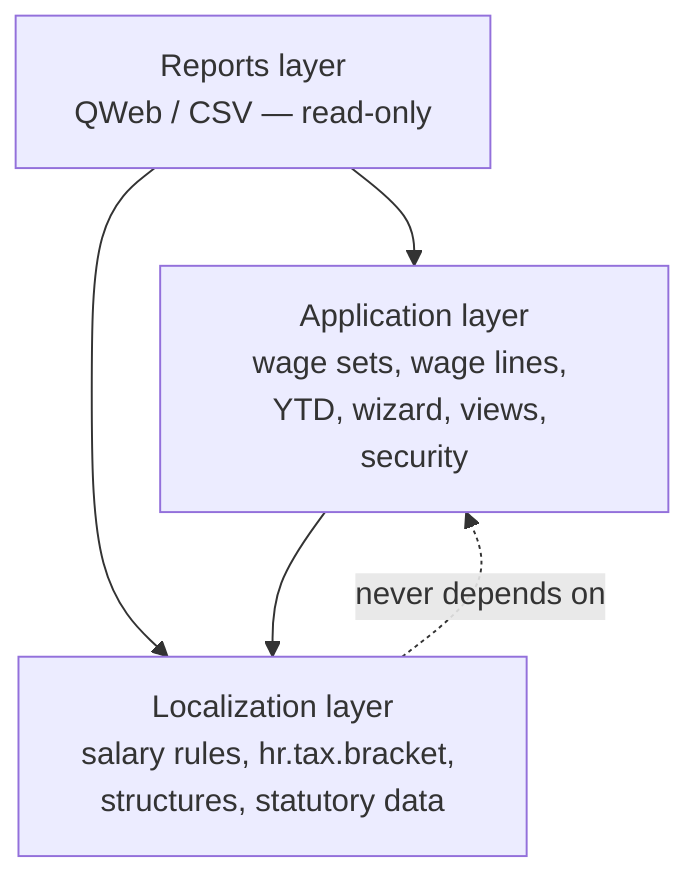
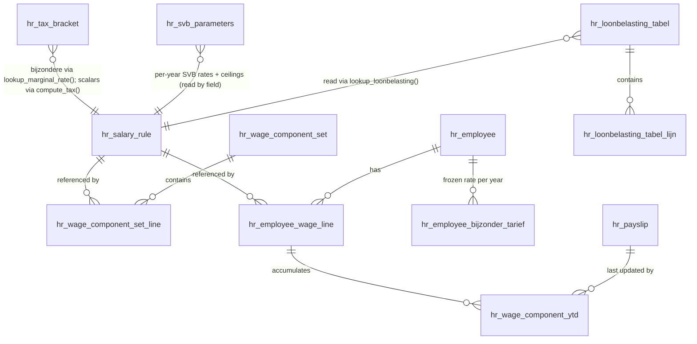
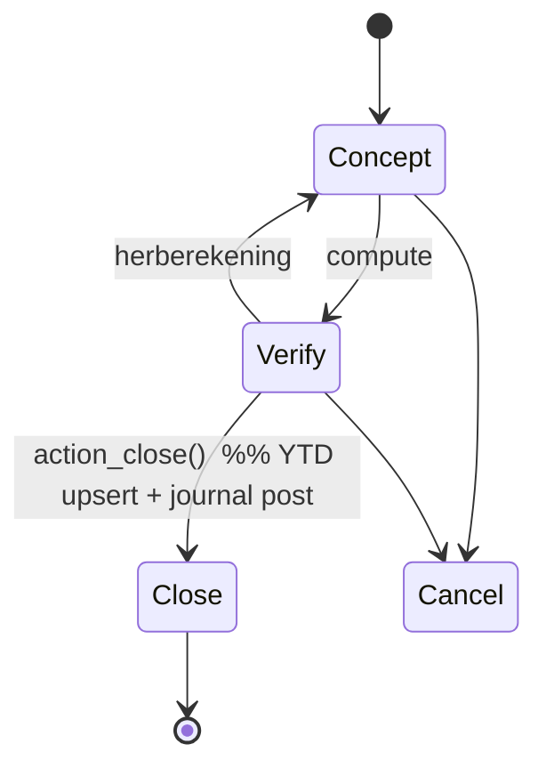

# Architecture Spine — l10n_cw_hr_payroll

The build-time consistency contract for the module. It fixes only the invariants that keep ~21 salary
rules, the data files, the custom models, and the reports from diverging. Everything structural — the
stack, the file tree, the field-level shape of each model, the full sequence map — is **seed**: settled
by Tech Design v3.0D and owned by the code once it exists. For that detail, read the tech design; this
spine does not mirror it.

## Design Paradigm

**Odoo Enterprise localization module** following the official `l10n_*_hr_payroll` pattern (analogous to
`l10n_be_hr_payroll`), layered on the native `hr_payroll` engine. The calculation core is a
**sequential salary-rule pipeline**: each `hr.salary.rule` is a filter that reads a shared payslip
context (`employee`, `contract`, `payslip`, `categories`, `rules`, `inputs`, `worked_days`, `env`) and
assigns `result`, in strict ascending sequence. Statutory values are **data, not code** — held in dated
records and read at runtime. Three layers map to directories:

| Layer | Owns | Directories |
| --- | --- | --- |
| Localization | Statutory definitions + dated data | `models/hr_salary_rule.py`, `models/hr_tax_bracket.py`, `models/hr_loonbelasting_tabel.py`, `models/hr_svb_parameters.py`, `models/hr_contract.py`, `models/hr_employee.py`, `data/`, salary-rule Python |
| Application | Config + workflow + UI + security | `models/hr_wage_component_set.py`, `models/hr_employee_wage_line.py`, `models/hr_wage_component_ytd.py`, `models/hr_employee_bijzonder_tarief.py`, `wizard/`, `views/`, `security/` |
| Reports | Read-only rendering | `report/` |

## Invariants & Rules

Dependency direction (a rule, not just a picture — arrows = "may depend on"):



### AD-1 — Sign convention `[ADOPTED]`
- **Binds:** all salary rules.
- **Prevents:** `NET` miscomputing when an author returns a positive deduction.
- **Rule:** employee deductions and employee premiums return **negative** amounts; employer costs and
  income-base intermediates return positive. `NET` sums categories directly and relies on this.

### AD-2 — Category-assignment contract `[ADOPTED]`
- **Binds:** every rule's `category_id`.
- **Prevents:** an employer cost landing in `DED`, or an allowance outside `ALW`, silently breaking
  `NET` while every other rule is obeyed.
- **Rule:** `NET = BASIC + ALW + DED` (DED negative). Employer contributions go to `ER` and are
  **excluded** from `NET`. All overtime contributes to `ALW`. `NONTAXED` (onbelaste vergoedingen) is
  **not** in `BASIC/ALW/DED`: it is a separate post-`NET` line in its own category and a GL pass-through
  (employer-cost debit + payable credit). The amount paid to the employee is `NET + NONTAXED`.

### AD-3 — Strict sequence + reference discipline `[ADOPTED]`
- **Binds:** all salary rules.
- **Prevents:** two authors reordering or forward-referencing and producing different results.
- **Rule:** rules evaluate in fixed ascending `sequence` (10–150). A rule may reference only **prior**
  results, via `rules.CODE.amount` and `categories.X` — never a later rule. Hidden intermediates carry
  `appears_on_payslip = False`.

### AD-4 — Annualisation convention `[ADOPTED]`
- **Binds:** every rule applying a statutory ceiling, threshold, or bracket.
- **Prevents:** one author applying an annual ceiling directly to a monthly figure.
- **Rule:** periodic (monthly) base × 12 → apply the annual ceiling/scale/bracket → ÷ 12 back to
  periodic.
- **Exception — loonbelasting:** the `lb-*tabel` is already period-specific (monthly table → monthly
  result directly). LOONBEL_RAW (Seq 90) calls `lookup_loonbelasting` with the raw monthly `TAX_INC`
  and receives a monthly tax amount — no × 12 / ÷ 12. See AD-20.
- **Superseded for SVB annual ceilings — use the cumulative method.** The per-month ×12 here is an
  approximation that mis-fires at the ceiling for irregular income; for the **annual** SVB ceilings
  (AOV/AWW, BVZ, AVBZ) the binding method is the **cumulative annual-maximum** of **AD-24**, not ×12/÷12.
  ZV/OV use a monthly cap (AD-22), also not ×12. So this ×12/÷12 rule now governs no production premium
  path directly — it is retained as the conceptual frame that AD-24 (annual) and the monthly caps refine.

### AD-5 — Dated-rate authority `[ADOPTED]` (resolves the rates fork)
- **Binds:** **all** statutory rates and ceilings — the SVB premiums (AOV/AWW, AVBZ, BVZ, ZV, OV) and
  their ceilings, the bijzondere-beloningen rates, the verwervingskosten forfeit, the basiskorting, and
  the toeslagen.
- **Prevents:** a rate change requiring a code deploy (the PRD regulatory-agility goal); two rules
  holding divergent copies of the same rate.
- **Rule:** **no statutory rate, ceiling, or threshold is a literal in rule Python** — every one is a
  **dated, append-only** data record (never deleted; superseded by setting `valid_to` and inserting a
  new `valid_from`), read at runtime. Three stores, by data shape:
  - **SVB premiums (rates + ceilings)** → one **per-year** `hr.svb.parameters` record (AD-22). The
    single source of truth for every SVB rate and ceiling.
  - **Loonbelasting** → the official `lb-*tabel` in `hr.loonbelasting.tabel` (AD-20). The Schijventarief
    (inkomstenbelasting bracket table) is **not** the withholding instrument and must not be used.
  - **Bijzondere beloningen + the Belastingdienst scalars** (basiskorting, verwervingskosten, toeslagen)
    → `hr.tax.bracket`, keyed by `tax_type` (`income_from`/`income_to`, `rate`, `valid_from`/`valid_to`;
    no payer field).
- **Read/representation contract** — so two authors encode and read identically:
  - *Marginal-rate lookup* (`bijzondere_beloning`, in `hr.tax.bracket`): one ordered set of dated band
    records; read via `lookup_marginal_rate(jaarloon, 'bijzondere_beloning', date)`, which returns the
    **single band rate** whose range contains `jaarloon` — band match is `income_from ≤ jaarloon <
    income_to` (matching the table's *"groter of gelijk aan … maar kleiner dan"*; `income_to = 0` = top
    band, uncapped) — it does **not** accumulate. EXTRA_TAX applies that one rate to the
    bijzondere-beloning amount (see AD-21).
  - *Dated scalar* (basiskorting, verwervingskosten, toeslagen, in `hr.tax.bracket`): a single dated
    value read by `compute_tax(tax_type, date)` (the one surviving caller of `compute_tax` after the
    SVB move) — a flat amount/rate, no band accumulation.
  - *SVB premium* (in `hr.svb.parameters`, AD-22): the rule reads the relevant rate and ceiling **field**
    from the year's record, caps the annualised base at the ceiling, applies the rate, de-annualises
    (AD-4). Per the official SVB 2026 table the employee shares are **flat** (BVZ 4.3 %, AVBZ 1.5 %,
    AOV+AWW 6.5 %); the AOV surcharge is 1 % on the base **above** the AOV/AWW grens (computed as
    `rate × max(0, base − grens)`, never the whole base). There are **no** income-graduated employee
    scales.
  - Data records hold **only** rates, ceilings, and band bounds — never the arithmetic, which stays in
    the rule per AD-4.
- **Note:** this overrides the v3.0D rule listings, which hardcode premium literals
  (9.3 %, 6.5/9.5 %, 150 000, 100 000, 606 247.08, 41.67). **The official Belastingdienst (loonbelasting)
  and SVB (premiums) annual publications are authoritative**; any rate, ceiling, or scale in the v3.0D
  tech design is indicative only and is superseded by them. Per the SVB 2026 table the v3.0D "sliding
  scales" (BVZ 0–4.3 % bands; AVBZ 29 897.44 threshold) **do not exist** — BVZ and AVBZ employee shares
  are flat with a ceiling. *(This Rule supersedes the earlier per-`tax_type` SVB split: the granular SVB
  `tax_type` values moved to `hr.svb.parameters` in AD-22; `hr.tax.bracket` keeps `bijzondere_beloning`
  and the Belastingdienst scalars.)*

### AD-6 — Enable/disable gate + never-gate set `[ADOPTED]`
- **Binds:** all premium/tax computation rules and the six shared intermediates.
- **Prevents:** gating a shared base (e.g. `AOV_PREM_INC`) and silently breaking AVBZ for an
  AOV-exempt employee.
- **Rule:** each premium/tax rule checks its `hr.employee.wage.line.enabled`; if `False` → `result =
  0.00`, skip logic (downstream receives `0.00`, never an error or stale value). The **never-gate set
  always executes** regardless of any flag: `BVZ_PREM_INC` (20), `AOV_PREM_INC` (50), `TAX_INC` (80),
  `LOONBEL_RAW` (90), `NET` (130), `TOTAL_ER_COST` (150).

### AD-7 — `active` vs `enabled` semantic split `[ADOPTED]`
- **Binds:** `hr.employee.wage.line`.
- **Prevents:** conflating UI visibility with calculation participation; losing the audit trail of a
  deliberate exemption.
- **Rule:** `active = False` hides the line **and** excludes it from calculation; `enabled = False`
  keeps it **visible** for audit but returns `0.00`. Independent. A statutory exemption is
  `active = True, enabled = False`.

### AD-8 — Three-tier decoupling `[ADOPTED]`
- **Binds:** `hr.salary.rule` (T1) → `hr.wage.component.set` (T2) → `hr.employee.wage.line` (T3).
- **Prevents:** a template edit retroactively mutating live employee payroll; ambiguous ownership of a
  wage line.
- **Rule:** applying a T2 set is a **one-time copy** via `hr.wage.set.apply.wizard` that creates
  independent T3 records; later T2 edits do **not** propagate. `T3.salary_rule_id` is read-only after
  creation. After apply, T3 is the sole owner of its values.

### AD-9 — Single state-commit point `[ADOPTED]`
- **Binds:** `hr.payslip.run.action_close()`.
- **Prevents:** double-counted YTD or duplicate/unbalanced journal postings from a second mutation path.
- **Rule:** `action_close()` is the **only** place results are committed, in order: confirm + lock
  payslips → upsert `hr.wage.component.ytd` → upsert the per-(employee, year) bijzondere-beloningen
  tarief record (AD-21) → post the `account.move` (draft → posted) → expose run reports. `ytd`, the
  tarief record, and the journal are mutated nowhere else. Recompute (herberekening) is permitted only
  **before** close.
- **Idempotent close (PRD allows reopening a closed run).** `hr.wage.component.ytd` holds a single
  scalar `ytd_amount` per (employee, rule, year), so close must **recompute** it, not blindly
  increment: on close, `ytd_amount` is set to the **sum over that year's confirmed payslip lines** for
  the (employee, rule) — making the value a pure function of the confirmed payslips and identical no
  matter how many times the run is closed. `last_updated`/`last_payslip_id` record the most recent
  close. Reopening a run **reverses** its posted `account.move`. **Prevents:** double-counted YTD and
  duplicate journal postings on reopen → re-close.
- **Reopen is the controlled in-app path — not a database restore.** The controlled reopen above
  (reverse journal + recompute) is the **only** reopen mechanism the module provides. A whole-database
  restore is **outside the application's responsibility**: Odoo.sh offers only whole-DB backup/restore
  (no partial restore), which would roll back every user's unrelated work, so it is a coordinated,
  disaster-only operational measure — never the routine reopen. A **pre-close manual Odoo.sh backup** is
  the recommended operational safety step before close (an Odoo.sh dashboard action, not a module
  feature); destructive source-data mutations are otherwise tested in an Odoo.sh **Staging** branch, not
  on production. A custom application-level payroll snapshot/restore is **out of scope for v1.0R** (see
  Deferred).

### AD-10 — Accounting balance by construction `[ADOPTED]`
- **Binds:** the journal posted at close.
- **Prevents:** an unbalanced `account.move`; treating placeholder GL numbers as fixed.
- **Rule:** every employer-cost debit has a matching payable credit; total debit ≡ total credit by the
  NET identity (`total loon = net + all employee deductions`). GL account numbers are indicative,
  mapped to the company chart at onboarding — not requirements.

### AD-11 — Layer boundaries + dependency direction `[ADOPTED]`
- **Binds:** module package layout (see diagram above).
- **Prevents:** a report recomputing tax (a second source of truth); the localization layer depending
  on application/report code.
- **Rule:** dependencies point **inward** toward Localization. Reports read computed data and render
  only — they never compute a statutory amount. Localization never imports Application or Reports.

### AD-12 — Money & rounding discipline `[ADOPTED]`
- **Binds:** tax/premium rule outputs, `compute_tax`, `lookup_loonbelasting`, the journal, and the
  declaration reports.
- **Prevents:** accumulated rounding drift; toeslagen mis-modeled as taxable-income reductions; a
  declaration showing decimals, or the journal being truncated to whole units.
- **Rule:** currency is XCG; `compute_tax` and `lookup_loonbelasting` both return `round(x, 2)`;
  acceptance tolerance is XCG 0.02 (rounding only). `lookup_loonbelasting` returns the **raw**
  loonbelasting from the table **before** toeslagen; toeslagen are then applied as **monetary
  deductions from the tax amount** (not income reductions), floored at 0.
- **Presentation rounding (declarations vs journal):** the calculation engine, payslips, and the
  journal (`account.move`) keep the **actual 2-decimal amounts**. **Tax returns / declarations (B-01,
  B-02) present whole XCG** — decimals are **dropped (truncated), not rounded**. This is a Reports-layer
  presentation rule (AD-11) applied to already-computed amounts; it never alters the engine or journal
  values.

### AD-13 — Statutory defaults applied unconditionally `[ASSUMPTION]`
- **Binds:** verwervingskosten forfeit and basiskorting.
- **Prevents:** an inconsistent baseline across employees; a basiskorting double-count.
- **Rule:** verwervingskosten (XCG 41.67/mo — the statutory forfeit, max XCG 500/yr) and basiskorting
  (XCG 2 915/yr = XCG 242.92/mo — the official 2026 figure on the Belastingdienst *Loonbelastingverklaring
  2026*, AD-5) apply automatically to **all** employees for v1.0R (Option A). A per-employee disable is a
  deferred change request (PRD A-06 / OQ-02). *(Correction 2026-06-28: the earlier 3 247.35 was an
  inkomstenbelasting figure, not the loonbelasting withholding basiskorting; the Loonbelastingverklaring
  2026 states 2 915/yr. The v3.0D 2 915 was therefore correct, not a prior-year value.)*
- **No double-count — the maandtabel is *exclusief basiskorting*.** The 2026 `lb-maandtabel` is published
  **exclusief basiskorting** (it taxes from the first gulden), so basiskorting is **not** already in
  `LOONBEL_RAW`; it is a **live, required** separate deduction applied **after** the table lookup
  (Seq 100, as a monetary deduction from the tax amount per AD-12), floored at 0. This is what consumes
  the basiskorting scalar read via `compute_tax` (AD-5).
- **`[RESOLVED 2026-06-28]` Application point — verwervingskosten vs basiskorting.** Confirmed against the
  official Belastingdienst *Loonbelastingverklaring 2026* and source guidance: the two are distinct
  instruments at distinct sequence points. **Verwervingskosten is an income deduction (aftrekpost)** —
  it reduces the taxable wage `TAX_INC` **pre-table (Seq 80)**; **basiskorting and the toeslagen are tax
  credits (heffingskortingen)** — they reduce the computed tax amount **post-table (Seq 100, AD-12)**,
  floored at 0. Verwervingskosten touches **only** `TAX_INC` (never the SVB premie-loon base, AD-14).
  The earlier "lumps both as post-table deductions" risk is closed: they must **not** share a sequence
  point.

### AD-14 — Canonical premium-base derivation `[ADOPTED]`
- **Binds:** all premium income-base rules (`BVZ_PREM_INC`, `AOV_PREM_INC`).
- **Prevents:** BVZ and AOV diverging on whether overtime is in the base.
- **Rule:** premium bases derive from `categories.BASIC + categories.ALW` (**overtime included** via
  `ALW`), **not** from individual `rules.X` refs — so all bases stay mutually consistent. This fixes the
  v3.0D source contradiction in which `BVZ_PREM_INC` used `rules.TOTAL_LOON.amount` (excluding
  overtime): `BVZ_PREM_INC` must be refactored to the `categories.BASIC + categories.ALW` base.
- **Resolution:** overtime-in-base confirmed by the product owner (2026-06-26) — settles the prior open
  question.

### AD-15 — Scoped presentation theming `[ADOPTED]`
- **Binds:** all module views/reports and the `cw_theme_prl10n` SCSS.
- **Prevents:** the theme leaking onto Odoo's own/inherited pages — one developer scoping correctly
  while another applies the wrapper to an inherited `hr.employee`/`hr.contract` view and restyles
  Odoo's native screens.
- **Rule:** the module ships an in-module SCSS bundle `static/src/scss/cw_theme_prl10n.scss`, registered
  via the manifest `assets` key (`web.assets_backend`) — never the `data` list, and **no theme module
  dependency**. Every rule is scoped under a single `.cw_theme_prl10n` wrapper class, applied **only** to
  the module's own custom-model views (`hr.tax.bracket`, `hr.wage.component.set`,
  `hr.employee.wage.line`, CW-owned payslip/run views) — **never** on inherited Odoo-model views. Tokens
  are CSS variables with light (`:root`) and dark (`.o_dark_mode`) modes. (Reference only, not a
  dependency: the `cw_theme` module.) Theming is presentation — it computes no statutory amount (AD-11).

### AD-16 — Senior-only payslip-distribution gate `[ADOPTED]`
- **Binds:** the payslip-distribution action on `hr.payslip.run` and the security groups.
- **Prevents:** payslips reaching employees before the run is final and verified — e.g. distribution
  while a reopen/correction is still possible, or by a non-senior user.
- **Rule:** distribution is a **separate, explicit action**, restricted to the **most senior existing
  role — the Payroll Manager group (`group_l10n_cw_payroll_manager`)**; no new group is added. It is
  allowed **only after** the run is closed (AD-9) **and** an explicit "no restore needed" confirmation.
  Closing a run does **not** distribute; distribution is a deliberate second step. The distribution
  **channel** (email / Employee Portal / app) is deferred (OQ-01) — this AD fixes only the *gate*, not
  the medium.

### AD-17 — Canonical effective date for dated lookups `[ADOPTED]`
- **Binds:** every dated-rate / bracket lookup, every `compute_tax` call, and every
  `lookup_loonbelasting` call in the calculation.
- **Prevents:** rules within one payslip reading rates from different effective dates; a historical
  recompute silently using *today's* rates (the v3.0D `compute_tax` defaults to `today()`).
- **Rule:** all dated lookups use **one canonical effective date — the payslip's period-end date**
  (`payslip.date_to`), passed explicitly to `compute_tax`, `lookup_loonbelasting`, and bracket
  searches. Neither method may fall back to `today()` in payroll context. Recomputing a historical
  payslip therefore reproduces the table and rates in force for its period (consistent with AD-5's and
  AD-20's append-only dated records).

### AD-18 — Fail loud on missing statutory data `[ADOPTED]`
- **Binds:** `compute_tax`, `lookup_loonbelasting`, and any required dated-rate lookup.
- **Prevents:** a missing rate/bracket/table silently yielding 0 → wrong, zero statutory tax/premium.
- **Rule:** if a **required** statutory rate, bracket, scale, or loonbelasting table entry is absent
  for the effective date, raise a **blocking error** (`UserError`, naming the `tax_type` or
  `period_type` and date) — **never return 0**. This is distinct from AD-6: a *disabled* premium
  deliberately returns 0; *missing statutory data* is a defect that must stop the run, not pass
  silently.

### AD-19 — Company scoping (multi-company-safe) `[ADOPTED]`
- **Binds:** every model's company scope and its record rules.
- **Prevents:** national rates being duplicated or diverging per company; operational payroll data
  leaking across companies.
- **Rule:** **National statutory data is global/shared** — `hr.tax.bracket`, `hr.loonbelasting.tabel`
  (+ `.lijn`), the CW salary rules and categories, and the `CWMONTHLY`/`CWSTAFF` structures carry no
  `company_id` (one Curaçao ruleset for all CW companies). **Operational data is company-scoped** via
  `company_id` with multi-company record rules — `hr.wage.component.set`(+line),
  `hr.employee.wage.line`, `hr.wage.component.ytd`, payslips / runs, and the journal. This holds
  whether an install is single- or multi-company; actual multi-company *enablement* remains an open
  question (kept cheap and safe by this scoping either way).

### AD-20 — Loonbelasting table model `[ADOPTED]` (2026-06-27)
- **Binds:** LOONBEL_RAW (Seq 90) and any future period-specific payroll rule.
- **Prevents:** using the Schijventarief (the annual *inkomstenbelasting* bracket table) as the
  loonbelasting withholding instrument — which is conceptually wrong; employers must use the published
  `lb-*tabel`. Also prevents annualizing a period-specific table.
- **Background:** Loonbelasting is a periodic *withholding* on wages only (a prepayment of
  inkomstenbelasting). Its statutory instrument is the `lb-*tabel` series published annually by the
  Minister of Financiën via Ministeriële Regeling (source: MR 144, 2024). The Schijventarief is the
  annual inkomstenbelasting table filed by taxpayers; it is not the employer's withholding instrument.
- **Rule:**
  - Loonbelasting is looked up in `hr.loonbelasting.tabel` (header) / `hr.loonbelasting.tabel.lijn`
    (rows): one row per `(tabel_id, wage_from)` where `wage_from` are the exact wage points in the
    published table.
  - **Header fields:** `name` (e.g. "Maandtabel 2026", "Maandtabel 2026 Correctie 1"),
    `period_type`, `year` (Integer, e.g. 2026), `valid_from`, `valid_to` (nullable), `active`,
    `above_ceiling_rate` (Float; the top marginal rate applied above the table ceiling — 46.5 % for
    2026).
  - **Selection rule:** `lookup_loonbelasting(wage, period_type, date)` searches for
    `active=True` headers where `period_type` matches, `year = date.year`,
    `valid_from ≤ date`, and `valid_to` is null or `≥ date`, ordered by
    **`valid_from desc, id desc`, limit 1**. This means: among all versions valid on the
    payslip date, the one with the latest effective date wins; ties (same `valid_from`,
    e.g. a retroactive correction uploaded later) are broken by the most recently uploaded
    record (`id desc`). No mandatory archiving step — the ordering selects automatically.
  - **Correction handling:** when the Belastingdienst publishes a corrected table for the
    same year, upload it as a new header with the same or a later `valid_from`.
    - Retroactive correction (`valid_from = year-start`): the new record wins for *all*
      payslips in that year (highest `id`); herberekening on prior-period payslips
      automatically uses the corrected table.
    - Prospective correction (`valid_from = correction-effective-date`): payslips with
      `date_to` before that date continue using the earlier version.
  - **Lookup key:** `wage_from = floor(TAX_INC / step) * step`, where `step` is the table's
    publication step for the `period_type` (maand: 5.00; week: 5.00; dag: 2.50; halvedag: 1.25;
    quincena: TBC; kwartaal: TBC).
  - **Above-ceiling (statutory, MR 144 § Algemeen):** if `TAX_INC > max(wage_from)` for the
    selected table: `loonbelasting = ceiling_tax + (TAX_INC − ceiling_wage) × above_ceiling_rate`,
    where `above_ceiling_rate` is the **header field** (46.5 % for 2026) — **not** a code literal, so a
    rate change is a data update, not a deploy (AD-5). *Worked example (Maandtabel 2026, wage 20 000):*
    `4 862.91 + (20 000 − 16 670) × 0.465 = 4 862.91 + 1 548.45 = 6 411.36`.
  - **Missing table → `UserError`** (AD-18) — never return 0.
  - **No annualization** — the table is period-specific; the monthly result is used directly (AD-4
    exception).
  - **Effective date:** `payslip.date_to` (AD-17).
  - **Global scope:** no `company_id` — one national table for all CW companies (AD-19).
  - **Append-only:** table rows are never deleted; superseded headers are retained for audit
    (may be archived with `active=False` once a replacement is active).
  - **Exclusief basiskorting is the required variant.** Belastingdienst publishes the maandtabel in
    two variants — *inclusief* and *exclusief* basiskorting. The module seeds the **exclusief** table
    (taxes from the first gulden) because basiskorting is applied **separately** as a monetary deduction
    (AD-13). Seeding the *inclusief* variant would **double-count** the basiskorting (once in the table,
    once in the deduction) and silently under-tax every employee. A seed/load guard verifies the loaded
    table is the exclusief variant by a **value check** — the **zero-tax band width ≈ 0** (the inclusief
    table is tax-free up to ≈ `basiskorting ÷ first-rate` ≈ XCG 33,300/yr, the exclusief table taxes from
    the first gulden), or equivalently a known wage point matches the known exclusief value — **not** a
    fragile "first row non-zero" heuristic (which can false-reject an exclusief table whose first rows
    round to 0.00 at the publication step). The two variants are equivalent — exclusief table −
    basiskorting = inclusief table — so output still reconciles to the official inclusief calculator.
  - **v1.0R seeds the `maand` table only.** Other period types (`week`, `dag`, `halvedag`,
    `quincena`, `kwartaal`) are deferred to v1.1R when those pay periods are supported.

### AD-21 — Bijzondere beloningen tarief `[ADOPTED]` (2026-06-27)
- **Binds:** the EXTRA_TAX rule and the per-(employee, year) bijzondere-beloningen tarief record.
- **Prevents:** divergent or non-reproducible withholding on bijzondere beloningen — two implementors
  computing the rate from different bases, recomputing the freeze differently on reopen, or taxing the
  same amount twice.
- **Background:** Per art. 8 lid 4 *Landsverordening op de Loonbelasting 1976*, remuneration *"welke
  gewoonlijk slechts eenmaal of eenmaal per jaar"* is enjoyed (tantième, gratificatie, vakantiegeld
  paid once a year, bonus, jubileumuitkering, and **incidentele overuren**) is taxed via the
  bijzondere-beloningen table — **not** the maandtabel. The applicable rate is set by the employee's
  **jaarloon** (Handleiding Loonbelasting 2004), and using the prior year's jaarloon is a legal
  *houvast* (safe harbor).
- **Rule:**
  - **Rate.** The tarief is the **single marginal rate** from the bijzondere-beloningen table
    (`bijzondere_beloning`, exclusief basiskorting) at the employee's jaarloon, read via
    `lookup_marginal_rate` (AD-5). EXTRA_TAX applies it to the bijzondere-beloning amount.
  - **Jaarloon basis (Handleiding 2004, three cases).** **A** — employed the whole prior year → the
    **actual prior-year jaarloon**; **B** — employed part of the prior year → that wage **annualised**
    (herleid tot jaarloon); **C** — joined this year → the **current-year expected jaarloon**. The
    payroll manager **may override** to the **current-year jaarloon** when the prior year is
    unrepresentative (a non-recurring bonus/jubileum, unusual overtime, a salary jump) — the source
    recommends this to avoid an IB-naheffing. The **current-year jaarloon** (Case C *and* the override)
    is the **projected** annual regular wage (`contract.wage × 12`), **not** the wage accumulated so far
    — so it does not drift with when in the year it is computed (keeping the override path
    order-independent too). *Jaarloon composition* (which components count) is seed/tech-design detail;
    the default is the annual regular taxable loon (prior-year total from YTD; Case C from the
    contract), excluding the bijzondere beloningen themselves.
  - **The annual rate is configuration, not a payslip selection — so it is order-independent.** The
    tarief for an (employee, tax year) is a function **only** of prior-year data and current-year
    config: the prior-year jaarloon (A/B), `contract.wage × 12` (C), or the manager override — **never**
    a current-year beloning payslip amount. Because no jaarloon basis reads a current beloning, the rate
    is identical regardless of which beloning is processed first or the order in which runs close: there
    is no "selection" left to be order-sensitive. It is **recomputed afresh next year** (the new prior
    year). *(This supersedes any "earliest-dated payslip defines it" reading — the value is fixed by
    prior-year/contract data, not by a payslip, so the YTD-style ownership rule is neither needed nor
    correct here, because the tarief feeds a posted withholding whereas YTD is pure reporting.)*
  - **Populated on first use; carried forward as the default.** During evaluation EXTRA_TAX takes, in
    order: the **manager override** entered for this payout if any → else the **(employee, year)
    record's stored rate** if present → else the **computed default** (prior-year jaarloon / Case C). At
    `action_close()` the (employee, year) record is **upserted to the current effective rate** (AD-9),
    so a manager override **becomes the carry-forward default** for the rest of that year (the whole year
    converges on the corrected rate); otherwise there is no auto-recompute per period. The current-year
    jaarloon is surfaced at each payout for the *"controleren"* check the source calls for. ("Calculated
    at the first extra beloning" means *populated on first use* — the value is fixed by
    prior-year / contract / override config, not by the beloning payslip.)
  - **The applied rate is recorded on the payslip line — the audit truth.** EXTRA_TAX records the rate
    it actually applied onto the payslip line (payslips already snapshot `worked_days`/`inputs`), so each
    payslip is self-describing and a historical recompute is auditable and reproducible. The
    (employee, year) record is the **carry-forward default**; the **line-level applied rate** is what was
    withheld — so a manager changing the override later cannot retroactively alter an already-posted
    withholding (reconciliation is via the IB return — see the scope exclusion below).
  - **Purity (narrow).** Two state items: the manager's **basis/override choice** is a **pre-close
    input** (entered on the payslip/wage line, read during evaluation like any wage-line config); the
    **(employee, year) tarief record** is **written only at `action_close()`** (AD-9). EXTRA_TAX only
    **reads** that record — rules never write it. Recording the applied rate onto the payslip line under
    computation is an ordinary line output, not a cross-record write (see Conventions).
  - **Single withholding route — the marker is a flag, not a category.** A bijzondere beloning is an
    **`ALW` earning carrying a boolean `is_bijzondere_beloning` flag** (on the wage component / line) —
    it is **not** moved to a separate category. Three consequences, each owned by a named rule: (i) it
    stays in `ALW`, so it **is** in the SVB premium base (AD-14) and in `NET` (AD-2), unchanged; (ii)
    the `TAX_INC` rule (Seq 80) **subtracts the flagged `ALW` components** from its base, so they never
    reach the maandtabel (`LOONBEL_RAW`, AD-20); (iii) EXTRA_TAX withholds on exactly the flagged
    components via the bijzondere-beloningen rate. Each earning is thus withheld by **exactly one**
    route — regular (incl. *regulier overwerk*) via `TAX_INC` → maandtabel, flagged-bijzondere (incl.
    taxable *incidentele overuren*) via EXTRA_TAX, or **Lei di Bion-exempt overtime** via neither
    (AD-23) — **never double-counted**. Overtime thus has **three** routes — *regulier* (maandtabel),
    *incidenteel* (bijzondere), or *Lei di Bion-vrijgesteld* (exempt, AD-23) — selected by the payroll
    manager via the component/flag; the engine enforces **no frequency threshold**.
  - **SVB premiums apply to bijzondere beloningen `[ADOPTED]`.** Premiums **do** apply (product owner,
    2026-06-27; corroborated by the source — *"alvast loonbelasting **en premies** over [het
    vakantiegeld] worden berekend"*). Category placement: the earnings **stay in `ALW`**, so AD-14's
    `BASIC + ALW` premium base includes them; only the `TAX_INC` exclusion above keeps them off the
    maandtabel. NET identity (AD-2) is undisturbed.
  - **Premium-calculation method `[ADOPTED]`.** A once-yearly lump in the premium base would make AD-4's
    monthly ×12 annualisation mis-fire at the ceiling. Resolved: SVB premiums use the **cumulative
    annual-maximum** method (AD-24) — premium on the YTD *premie-loon* capped at the annual ceiling,
    minus premium already withheld — so a bijzondere beloning bears premium only on the remaining
    headroom under the ceiling (source: *"sociale premies … als je het jaarmaximum nog niet hebt
    bereikt"*).
  - **Go-live.** Cases A/B read prior-year YTD, which does not exist in the module's first year; a
    manual prior-year-jaarloon entry covers existing employees for year one, after which YTD takes over.
  - **Effective date** `payslip.date_to` (AD-17); **company-scoped** operational data (AD-19); record on
    `mail.thread` for audit.
- **Assumption (v1.0R):** EXTRA_TAX uses the **exclusief basiskorting** table — correct for employees
  whose basiskorting is already applied via the maandtabel. The *inclusief* table (the no-regular-wage
  case) is the documented alternative and is **not** modelled in v1.0R.
- **Scope exclusion:** the module performs **no** year-end loonbelasting reconciliation of bijzondere
  beloningen. Any over/under-withholding from the prior-year safe-harbor rate is settled via the
  employee's *Aangifte Inkomstenbelasting* (Belastingdienst), per the source.

### AD-22 — Per-year SVB parameter table `[ADOPTED]` (2026-06-27)
- **Binds:** every SVB premium rule (AOV/AWW employee, employer, and 1 % surcharge; BVZ employee and
  employer; AVBZ employee and employer; ZV; OV) and all SVB rates, surcharge, and ceilings.
- **Prevents:** the H-2 divergence — a shared statutory ceiling stored in several `tax_type` records
  drifting out of sync when one copy is updated and a sibling is not. Also prevents a rate change
  requiring a code deploy.
- **Background:** SVB publishes **one** annual document (`SVB-Tabel-<year>.pdf`) carrying *all* premium
  percentages and income/loon ceilings together. The module stores it the same way — one record per
  year — so each ceiling exists **exactly once** and cannot diverge by construction.
- **Rule:**
  - All SVB premium **rates and ceilings** live in a single per-year `hr.svb.parameters` header — one
    record per premie year — mirroring the SVB publication. Each ceiling is stored **once**; every SVB
    rule reads it from that one record (no per-payer duplicate copies).
  - **Fields** (shape is seed/tech-design; illustrative): `year` (Integer), `valid_from`, `valid_to`
    (nullable), `active`; premium rates `aov_er`/`aov_emp`, `aww_er`/`aww_emp`, `bvz_er`/`bvz_emp`,
    `avbz_er`/`avbz_emp`, `zv` (employer), `bvz_pensioner`/`bvz_self`; the `aov_surcharge_rate` (1 %);
    the **annual** ceilings `aov_aww_grens` (100 000), `bvz_grens` (150 000), `avbz_grens` (606 247.08);
    and the **monthly** ZV/OV cap `zv_ov_loongrens_month` (7 146.10) — *one operative value per period*,
    not a month/year pair (the SVB sheet's 85 753.20/year is the annual equivalent, informational). The
    **OV** rate itself is per-employer by gevarenklasse and lives on the contract
    (`l10n_cw_ov_percentage`, OQ-07), **not** here — only the OV loongrens is shared. SVB **benefit**
    amounts (pensioenen, wezenpensioen) and **Cessantia** are **not** stored (out of payroll scope;
    Cessantia permanently out).
  - **Rate unit.** Every rate field is stored as a **percentage** (e.g. `bvz_er = 9.3` means 9.3 %); the
    rule divides by 100. No field is a fraction.
  - **Rule-to-field map (combine contract).** Each SVB rule reads named fields, so two authors can't
    diverge: `AOV_AWW_EMP` withholds **`aov_emp + aww_emp`** (6.0 + 0.5 = 6.5 %); `AOV_AWW_ER` pays
    **`aov_er + aww_er`** (9.0 + 0.5 = 9.5 %); the 1 % surcharge reads `aov_surcharge_rate`;
    `BVZ_EMP`/`BVZ_ER` read `bvz_emp`/`bvz_er`; `AVBZ_EMP`/`AVBZ_ER` read `avbz_emp`/`avbz_er`; `ZV`
    reads `zv`; `OV` reads the contract rate. The AOV and AWW fields are stored separately (as SVB
    publishes them) and **summed** in the rule.
  - **Selection (matches AD-20 exactly — no silent fallback).** Among `active=True` records with
    `year = payslip.date_to.year` **and** `valid_from ≤ payslip.date_to` **and** (`valid_to` null or
    `≥ payslip.date_to`), pick the latest by `valid_from desc, id desc` (newest version wins; a rare SVB
    correction is a new record selected automatically). A January payslip whose year's record is **not
    yet uploaded** therefore finds **no** record and **fails loud** — it must **never** fall back to the
    prior year's premiums.
  - **Missing record → `UserError`** (AD-18) — never silently 0, never a prior-year record.
  - **Global scope**, no `company_id` (AD-19); **append-only** (AD-5); superseded records retained for
    audit.
  - **Ceiling application.** The **annual** ceilings (`aov_aww_grens`, `bvz_grens`, `avbz_grens`) are
    applied **cumulatively** per AD-24 (YTD premie-loon capped at the ceiling, minus premium already
    withheld) — **not** per-month ×12 — so a once-yearly lump is charged only on the remaining headroom.
    The AOV surcharge is the cumulative 1 % **above** `aov_aww_grens`. The **ZV/OV** cap is **per-period
    (monthly)**: cap the **monthly** base at `zv_ov_loongrens_month` directly and apply the rate — **no
    annualisation, not cumulative** (an AD-4 exception, like the period-specific loonbelasting table).

### AD-23 — Lei di Bion exempt overtime `[ADOPTED]` (2026-06-27)
- **Binds:** the Lei di Bion exempt-overtime component, the rules that build `TAX_INC` (Seq 80) and the
  premium bases (`BVZ_PREM_INC` Seq 20, `AOV_PREM_INC` Seq 50), and the approval gate.
- **Prevents:** exempt overtime being taxed or premium-charged; *and* the exemption being claimed
  without the required, approved employer ruling — either of which is a statutory error.
- **Background:** a recent Curaçao law (*Lei di Bion*) lets overtime up to **10 hours/week**, under an
  approved employer *beschikking*, be paid **free of both loonbelasting and SVB premiums** (0 % / 0 %).
  Beyond the cap, or without the ruling, the overtime is taxable.
- **Rule:**
  - A Lei di Bion overtime earning carries a boolean `is_lei_di_bion_exempt` flag. When eligible it is
    **excluded from *both*** the `TAX_INC` base **and** the SVB premium base (the Seq 20 / Seq 50 bases
    subtract flagged-exempt `ALW` components, alongside the AD-21 bijzondere exclusion) — so it bears
    0 % loonbelasting **and** 0 % premies — yet it **is** paid to the employee (it remains in `NET`).
  - **Eligibility = (≤ 10 overtime hours/week) AND (a valid, approved employer *beschikking*).** The
    approval is a **dated record** (`hr.lei.di.bion.beschikking` or a dated approval field, with
    `valid_from`/`valid_to` and an `approved_by`), **provided and approved by the Payroll Manager**
    (`group_l10n_cw_payroll_manager`, the same senior gate as AD-16). Eligibility is evaluated
    **point-in-time at `payslip.date_to`** (AD-17): a payslip is exempt only if an approved beschikking
    is valid on that date. A revocation or new approval applies to periods by their `date_to`, **not**
    retroactively within an already-computed period. Without a valid approval the overtime is **not**
    exempt and falls back to a taxable route (AD-21): *regulier* → maandtabel or *incidenteel* →
    bijzondere.
  - **The 10 hrs/week cap is a manual determination, not engine arithmetic.** Since v1.0R is monthly,
    the spine fixes **no** week→month conversion (40 vs 43.33 vs ISO weeks): the approver enters the
    **eligible-exempt hours** as the exempt component and any remainder as a taxable overtime component.
    The engine applies the split it is **given** and computes no cap (consistent with AD-21's
    no-frequency-threshold rule). When both exempt and *regulier* overtime exist, the cap counts only
    the flagged-exempt hours.
  - *Worked example (screenshot):* 10 overuren = XCG 302.90 gross → exempt: **302.90 net** (0/0); not
    exempt: bijzondere 9.75 % → **273.37 net**.

### AD-24 — Cumulative annual-maximum premiums `[ADOPTED]` (2026-06-27)
- **Binds:** every SVB premium rule with an **annual** ceiling — AOV/AWW (employee, employer, 1 %
  surcharge), BVZ (employee, employer), AVBZ (employee, employer).
- **Prevents:** the per-month ×12 annualisation (AD-4) mis-firing at the ceiling when income is
  **irregular** — a once-yearly lump (vakantiegeld, bonus, incidentele overuren) in one month, or a
  mid-year crossing of the ceiling — which over- or under-charges premium in that month.
- **Rule:** an annual-ceiling premium is computed **cumulatively (voortschrijdend)**, not per-month:
  - `capped_ytd = min(premie_loon_YTD_incl_this_period, annual_ceiling)`
  - `premium_to_date = capped_ytd × rate`
  - `this_period_premium = premium_to_date − premium_already_withheld_YTD_before_this_period`
  - so a payment bears premium **only on the remaining headroom** under the annual maximum, and the
    year-total is exact regardless of how income is distributed across months. The AOV 1 % surcharge is
    the cumulative amount **above** `aov_aww_grens` by the same logic.
- **Cumulative reads are period-bounded sums of confirmed lines — NOT the annual YTD scalar.**
  `hr.wage.component.ytd` is a single annual scalar (Σ over the year's confirmed lines, AD-9) with **no
  period axis**, so it cannot express "before this period" once a run is reopened or recomputed (the
  scalar already includes the current and later periods). The cumulative cap therefore reads
  **period-bounded sums of confirmed payslip lines with `date_to < this payslip.date_to`** (AD-17):
  `premie_loon_before` = Σ the net premie-loon **base** rule's confirmed lines for prior periods;
  `premium_withheld_before` = Σ this premium rule's confirmed lines for prior periods. **Never** derive
  premie-loon as `premium ÷ rate` — above the ceiling premium is pinned at `ceiling × rate`, so `÷ rate`
  loses the over-ceiling base.
- **Named premie-loon base.** The cumulative base is the **net Seq 20 / Seq 50 base rule** —
  `BVZ_PREM_INC` for BVZ, and `AOV_PREM_INC` for AOV/AWW, the AOV surcharge, **and AVBZ** (same
  `BASIC + ALW` base). It is `categories.BASIC + categories.ALW` **minus** Lei di Bion-exempt overtime
  (AD-23), **including** taxable bijzondere beloningen (AD-21). These bases are payslip lines (hidden,
  `appears_on_payslip = False`) so their confirmed lines are summable; the premie-loon is **net of
  Lei di Bion-exempt by construction**.
- **A premium's enable/disable status is stable within a tax year (set-once invariant) — so the
  cumulative read needs no per-period re-gate.** `[RESOLVED 2026-06-28]` BVZ enrolment is **sticky**:
  once BVZ-insured an employee must remain insured; to stay **outside** the mandatory BVZ one must have
  been privately insured **continuously (ononderbroken) since 31 January 2013** — any interruption ends
  the exemption permanently; and the ANG 150 000 income-grens (DGA/ondernemer/gepensioneerde above
  the grens → wettelijk private) is an **annual** determination, not a monthly toggle. So within a tax
  year an annual-ceiling premium is either **enabled for all periods or disabled for all periods**.
  Consequently the never-gate base sum (`premie_loon_before` over prior confirmed periods) **equals** the
  enabled-period sum — there is no divergence, no mid-year claw-back, and **no per-premium counted-base
  line is required**. A full-year disable is clean zeros (consistent with AD-7); an enabled premium has
  every prior period in its base, exactly as the cumulative formula expects.
- **Mid-year enrolment change = deferred change request (out of scope for v1.0R).** Because status is
  set-once, a mid-year `enabled` flip is not a supported operational flow. **If** it is ever required,
  the fix is a per-premium hidden "counted-base" line (`base if that premium was enabled this period,
  else 0`), summed in place of the shared never-gate base — re-gating per period and reproducible from
  confirmed lines (AD-17). Documented here so the escape hatch is known, but not built for v1.0R.
- **Herberekening recomputes forward — mandatory, ascending.** Because each period's premium depends on
  every prior period, reopening or recomputing period *n* **requires** recomputing every later confirmed
  period *n+1 …* in **ascending** order; a run may **not** close leaving stale later periods. With the
  period-bounded read, the result is then order-independent and exact. YTD is still **written** only at
  `action_close()` (AD-9); the period-bounded query reads confirmed lines directly and does not violate
  the single-commit-point.
- **Exception:** **ZV/OV** use a **monthly** cap (AD-22), not an annual ceiling, so they are **not**
  cumulative — they cap the monthly base directly (AD-4 exception). Below any annual ceiling the
  cumulative method equals the simple flat-rate × base **to within rounding** — it redistributes the
  per-period ±0.01 rounding but the year-total is identical, so ordinary monthly payslips are unaffected
  beyond rounding (inside the XCG 0.02 tolerance).

## Consistency Conventions

| Concern | Convention |
| --- | --- |
| Naming | Custom fields on standard models prefixed `l10n_cw_`; new models `hr.<thing>` (e.g. `hr.tax.bracket`); rule codes UPPER_SNAKE (`AOV_AWW_EMP`); component-set technical codes UPPER_SNAKE and immutable (`STD_OFFICE`). |
| Statutory data | SVB premium rates + ceilings as a per-year `hr.svb.parameters` record (AD-22); bijzondere beloningen rates and the Belastingdienst scalars (basiskorting, verwervingskosten, toeslagen) as dated `hr.tax.bracket` records (AD-5); loonbelasting as versioned `hr.loonbelasting.tabel` entries (AD-20). All three are selected by `valid_from desc, id desc` among active records valid on `payslip.date_to` — the latest effective version wins, corrections handled by upload order — and are append-only. **Authoritative source:** the official Belastingdienst (loonbelasting, incl. basiskorting) and SVB (premiums, ceilings) annual publications govern; any literal in the v3.0D tech design is indicative only and superseded by them. |
| Money & rounding | XCG; round to 2 dp at rule output; deductions negative (AD-1); annualise to apply ceilings (AD-4). |
| State & mutation | Run/payslip state via Odoo states; YTD, the bijzondere-tarief record, and the journal are mutated only in `action_close()` (AD-9, AD-21); rules are pure functions of the payslip context and **never write** — EXTRA_TAX may *read* the per-(employee, year) tarief record and the manager's pre-close basis/override input, but no rule writes any record. |
| Audit & access | All custom models inherit `mail.thread`; four security groups enforce least privilege (Employee, Payroll User, Payroll Manager, Accountant); the most senior — Payroll Manager — also gates distribution (AD-16) and approves the Lei di Bion beschikking (AD-23); employee record rule restricts payslips to `employee_id.user_id = user`. |
| Disable semantics | `active` = visibility+calc; `enabled` = calc-only (AD-7); never gate the never-gate set (AD-6). |
| Effective date & missing data | All dated lookups use the payslip period-end date (AD-17); a missing required rate hard-errors, never 0 (AD-18). |
| Schema migration | Schema changes (e.g. the AD-22 `hr.svb.parameters` model and the AD-5 `tax_type` changes) ship Odoo migration scripts that preserve historical payslips and closed YTD; never destructively drop or rewrite historical statutory records (append-only, AD-5, AD-22). |
| Company scope | National statutory data global; operational data company-scoped via `company_id` (AD-19). |

## Stack

Seed — verified current at authoring; the code owns this once it exists.

| Name | Version |
| --- | --- |
| Odoo Enterprise | 19.0 (Odoo.sh or self-hosted; SaaS unsupported) |
| Module version | 19.0.0.1.0 |
| License | OPL-1 |
| Country | `cw` |
| Direct depends | `hr`, `hr_contract`, `hr_holidays`, `hr_payroll`, `hr_payroll_account`, `hr_attendance` |

## Structural Seed

Core custom entities (names + relationships only; field-level shape lives in the tech design):



Run/payslip lifecycle (commit point is AD-9):



Minimal source tree (full tree in tech design §13):

```text
l10n_cw_hr_payroll/
  models/    # Localization (rule ext, tax bracket, loonbelasting tabel, svb parameters,
             #   contract/employee ext) + Application models
  data/      # CWMONTHLY/CWSTAFF, categories, salary rules, 2026 tax-bracket records,
             # 2026 SVB parameters record, 2026 lb-maandtabel (~3,335 rows CSV)
  wizard/    # T2 -> T3 apply wizard
  views/     # forms, menus (incl. hr_loonbelasting_tabel_views.xml)
  report/    # QWeb payslip + declarations (read-only)
  security/  # groups, record rules, ir.model.access.csv
  static/    # src/scss/cw_theme_prl10n.scss — scoped backend theme (assets bundle, AD-15)
  i18n/      # nl.po
```

## Capability → Architecture Map

| Capability / Area (PRD) | Lives in | Governed by |
| --- | --- | --- |
| Statutory calculation engine (Sequence 10–150) | Localization — salary-rule Python | AD-1, AD-2, AD-3, AD-4, AD-6, AD-12, AD-14 |
| Bijzondere beloningen withholding (EXTRA_TAX) + annual frozen tarief | Localization — EXTRA_TAX rule; Application — `hr.employee.bijzonder.tarief` | AD-5, AD-9, AD-21 |
| Overtime treatment (regulier / incidenteel / Lei di Bion-exempt) | Localization — overtime rules; Application — beschikking approval | AD-21, AD-23, AD-16 |
| SVB premiums — cumulative annual-maximum (ceiling-aware) | Localization — premium rules reading YTD | AD-22, AD-24, AD-9 |
| SVB premium rate management / regulatory agility | Localization — `hr.svb.parameters` (per-year) | AD-5, AD-22 |
| Loonbelasting table lookup + annual upload | Localization — `hr.loonbelasting.tabel` | AD-20 |
| Three-tier wage component model | Application — sets, wage lines, wizard | AD-7, AD-8 |
| Per-employee enable/disable exemptions | Application — `hr.employee.wage.line` | AD-6, AD-7 |
| YTD accumulation | Application — `hr.wage.component.ytd` | AD-9 |
| Run lifecycle & close | Application — `hr.payslip.run.action_close()` | AD-9 |
| Accounting integration | Application → `account.move` | AD-9, AD-10 |
| Declarations & payslip PDF | Reports | AD-11 |
| Backend UI theming (`cw_theme_prl10n`) | Application — `static/src/scss` | AD-15, AD-11 |
| Security & data protection | Application — `security/` | AD-11, conventions |

## Deferred

| Deferred | Reason it can wait |
| --- | --- |
| OQ-01 Payslip distribution **channel** (portal / app / email + language) | Onboarding config; no effect on the calculation spine. The distribution *gate* (senior-only, post-close) is fixed now in AD-16; only the medium is deferred. |
| OQ-03 Overtime default rates (150/150/200/200) | Indicative; confirm against labour regs before v1.0R sign-off. Rates are `parameter_value` data, not structural. |
| OQ-04 Granular per-group rights | Detailed-design refinement within the four-group model (the senior Payroll Manager also gates distribution, AD-16). |
| Custom application-level payroll snapshot / restore | v1.1R+. Odoo.sh has no partial restore; a payroll-only snapshot spans employee/contract/work-entry/input/wage-line with FK + since-snapshot reconciliation (high correctness risk). v1.0R relies on AD-9 controlled reopen, the draft batch as checkpoint, a pre-close manual Odoo.sh backup, and Staging for testing. |
| OQ-05 Final GL account numbers | Per-company mapping at onboarding (v1.1R); AD-10 holds regardless of the numbers. |
| OQ-07 SVB gevarenklasse model | Interim `l10n_cw_ov_percentage` Float on contract; future Many2one `l10n_cw.svb.industry` (localization layer) once the official list is sourced. |
| Pay periods beyond monthly; ZV sick pay; loans/garnishments; verzamelloonstaat & jaaropgaaf CSV; e-filing; DGA; Aruba/SXM | Out of scope for v1.0R per PRD roadmap (v1.1R+). Same paradigm; period-specific divisors/tables. |
| Operational envelope (CI/CD, branch testing, upgrades) | Owned by the Odoo.sh platform, not module code; no module-level decision needed. |
