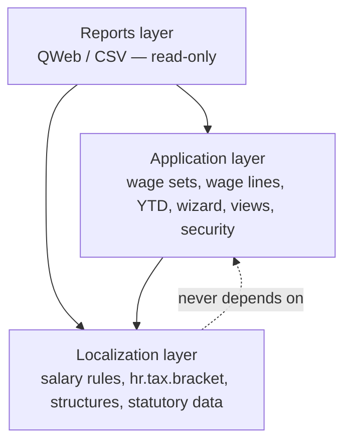
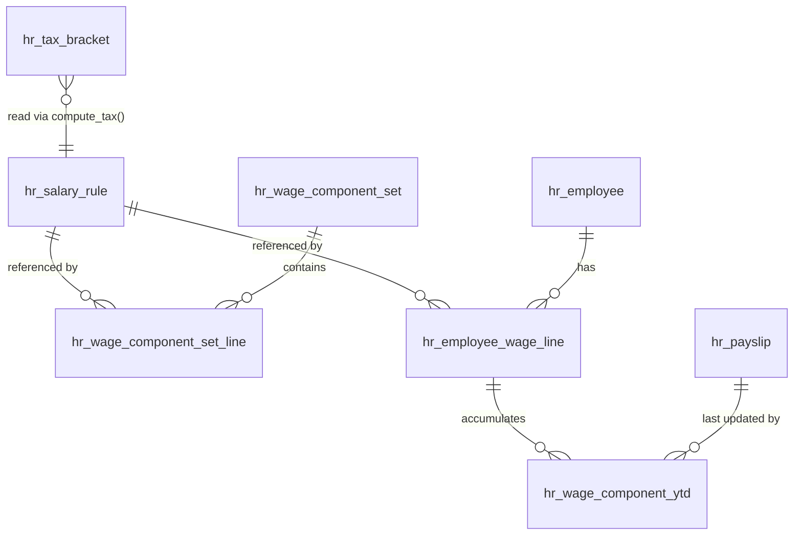
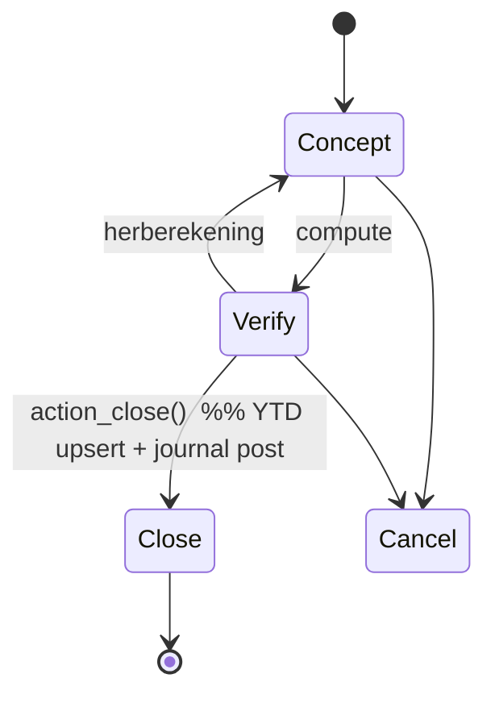

# Architecture Spine — l10n_cw_hr_payroll

The build-time consistency contract for the module. It fixes only the invariants that keep ~21 salary
rules, the data files, the custom models, and the reports from diverging. Everything structural — the
stack, the file tree, the field-level shape of each model, the full sequence map — is **seed**: settled
by Tech Design v3.0D and owned by the code once it exists. For that detail, read the tech design; this
spine does not mirror it.

## Design Paradigm

**Odoo Enterprise localization module** following the official `l10n_*_hr_payroll` pattern (analogous to
`l10n_be_hr_payroll`), layered on the native `hr_payroll` engine. The calculation core is a
**sequential salary-rule pipeline**: each `hr.salary.rule` is a filter that reads a shared payslip
context (`employee`, `contract`, `payslip`, `categories`, `rules`, `inputs`, `worked_days`, `env`) and
assigns `result`, in strict ascending sequence. Statutory values are **data, not code** — held in dated
records and read at runtime. Three layers map to directories:

| Layer | Owns | Directories |
| --- | --- | --- |
| Localization | Statutory definitions + dated data | `models/hr_salary_rule.py`, `models/hr_tax_bracket.py`, `models/hr_contract.py`, `models/hr_employee.py`, `data/`, salary-rule Python |
| Application | Config + workflow + UI + security | `models/hr_wage_component_set.py`, `models/hr_employee_wage_line.py`, `models/hr_wage_component_ytd.py`, `wizard/`, `views/`, `security/` |
| Reports | Read-only rendering | `report/` |

## Invariants & Rules

Dependency direction (a rule, not just a picture — arrows = "may depend on"):



### AD-1 — Sign convention `[ADOPTED]`
- **Binds:** all salary rules.
- **Prevents:** `NET` miscomputing when an author returns a positive deduction.
- **Rule:** employee deductions and employee premiums return **negative** amounts; employer costs and
  income-base intermediates return positive. `NET` sums categories directly and relies on this.

### AD-2 — Category-assignment contract `[ADOPTED]`
- **Binds:** every rule's `category_id`.
- **Prevents:** an employer cost landing in `DED`, or an allowance outside `ALW`, silently breaking
  `NET` while every other rule is obeyed.
- **Rule:** `NET = BASIC + ALW + DED` (DED negative). Employer contributions go to `ER` and are
  **excluded** from `NET`. All overtime contributes to `ALW`. `NONTAXED` (onbelaste vergoedingen) is
  **not** in `BASIC/ALW/DED`: it is a separate post-`NET` line in its own category and a GL pass-through
  (employer-cost debit + payable credit). The amount paid to the employee is `NET + NONTAXED`.

### AD-3 — Strict sequence + reference discipline `[ADOPTED]`
- **Binds:** all salary rules.
- **Prevents:** two authors reordering or forward-referencing and producing different results.
- **Rule:** rules evaluate in fixed ascending `sequence` (10–150). A rule may reference only **prior**
  results, via `rules.CODE.amount` and `categories.X` — never a later rule. Hidden intermediates carry
  `appears_on_payslip = False`.

### AD-4 — Annualisation convention `[ADOPTED]`
- **Binds:** every rule applying a statutory ceiling, threshold, or bracket.
- **Prevents:** one author applying an annual ceiling directly to a monthly figure.
- **Rule:** periodic (monthly) base × 12 → apply the annual ceiling/scale/bracket → ÷ 12 back to
  periodic.

### AD-5 — Dated-rate authority `[ADOPTED]` (resolves the rates fork)
- **Binds:** **all** statutory rates and ceilings — including the SVB premiums (AOV/AWW, AVBZ, BVZ, ZV,
  OV), the verwervingskosten forfeit, and the toeslagen — not only loonbelasting and bijzondere
  beloningen.
- **Prevents:** a rate change requiring a code deploy (the PRD regulatory-agility goal); two rules
  holding divergent copies of the same rate.
- **Rule:** statutory values live in `hr.tax.bracket` as **dated** records (its `tax_type` already
  enumerates `aov_aww / avbz / bvz / zv_ov`) and are read at runtime via `compute_tax()` / dated
  lookups. **No statutory rate, ceiling, or threshold is a literal in rule Python.** Records are
  **append-only**: never deleted; superseded by setting `valid_to` and inserting a new `valid_from`.
- **`tax_type` is the sole discriminator.** `hr.tax.bracket` carries only `tax_type`,
  `income_from`/`income_to`, `rate`, `valid_from`/`valid_to` — no payer/role field, and
  `compute_tax(income, tax_type, date)` takes no payer argument. The v3.0D `tax_type` enumeration is
  therefore **too coarse**: `bvz`, `avbz`, `aov_aww`, and `zv_ov` each conflate several distinct rates
  (employee vs employer vs surcharge; ZV vs OV) with no way to select one. **Seed change:** `tax_type`
  is expanded to one value per (insurance, payer/role) — `loonbelasting`, `bijzondere_beloning`,
  `bvz_emp`, `bvz_er`, `avbz_emp`, `avbz_er`, `aov_aww_emp`, `aov_aww_er`, `aov_aww_surcharge`, `zv`,
  `ov` — so a single `tax_type` uniquely identifies one rate/scale. No payer argument is added.
- **Read/representation contract (per `tax_type`)** — so two authors encode and read identically:
  - *Progressive* (`loonbelasting`, `bijzondere_beloning`): one ordered set of band records;
    `compute_tax` accumulates band-by-band and returns the tax (`income_to = 0` = top band uncapped).
  - *Flat with ceiling* (`bvz_er`, `avbz_er`, `aov_aww_er`, `zv`, `ov`): one dated record whose `rate`
    is the flat percentage and whose `income_to` is the annual ceiling (`0` = none). The rule caps the
    annualised base at `income_to`, applies `rate`, de-annualises (AD-4).
  - *Sliding* (`bvz_emp` 0–4.3 %, `avbz_emp` 0.5/1.5 % threshold, `aov_aww_surcharge` 1 % above
    ceiling): multiple dated band records under that `tax_type`; the rule selects the band by the
    annualised base and applies that band's `rate`.
  - Bracket records hold **only** rates, ceilings, and band bounds — never the arithmetic, which stays
    in the rule per AD-4.
- **Note:** this overrides the v3.0D rule listings, which hardcode premium literals
  (9.3 %, 6.5/9.5 %, 150 000, 100 000, 606 247.08, 41.67). Those listings must be refactored to read
  from data. Sliding scales (BVZ 0–4.3 % bands; AVBZ 29 897.44 threshold) are expressed as banded dated
  records.

### AD-6 — Enable/disable gate + never-gate set `[ADOPTED]`
- **Binds:** all premium/tax computation rules and the six shared intermediates.
- **Prevents:** gating a shared base (e.g. `AOV_PREM_INC`) and silently breaking AVBZ for an
  AOV-exempt employee.
- **Rule:** each premium/tax rule checks its `hr.employee.wage.line.enabled`; if `False` → `result =
  0.00`, skip logic (downstream receives `0.00`, never an error or stale value). The **never-gate set
  always executes** regardless of any flag: `BVZ_PREM_INC` (20), `AOV_PREM_INC` (50), `TAX_INC` (80),
  `LOONBEL_RAW` (90), `NET` (130), `TOTAL_ER_COST` (150).

### AD-7 — `active` vs `enabled` semantic split `[ADOPTED]`
- **Binds:** `hr.employee.wage.line`.
- **Prevents:** conflating UI visibility with calculation participation; losing the audit trail of a
  deliberate exemption.
- **Rule:** `active = False` hides the line **and** excludes it from calculation; `enabled = False`
  keeps it **visible** for audit but returns `0.00`. Independent. A statutory exemption is
  `active = True, enabled = False`.

### AD-8 — Three-tier decoupling `[ADOPTED]`
- **Binds:** `hr.salary.rule` (T1) → `hr.wage.component.set` (T2) → `hr.employee.wage.line` (T3).
- **Prevents:** a template edit retroactively mutating live employee payroll; ambiguous ownership of a
  wage line.
- **Rule:** applying a T2 set is a **one-time copy** via `hr.wage.set.apply.wizard` that creates
  independent T3 records; later T2 edits do **not** propagate. `T3.salary_rule_id` is read-only after
  creation. After apply, T3 is the sole owner of its values.

### AD-9 — Single state-commit point `[ADOPTED]`
- **Binds:** `hr.payslip.run.action_close()`.
- **Prevents:** double-counted YTD or duplicate/unbalanced journal postings from a second mutation path.
- **Rule:** `action_close()` is the **only** place results are committed, in order: confirm + lock
  payslips → upsert `hr.wage.component.ytd` → post the `account.move` (draft → posted) → expose run
  reports. `ytd` and the journal are mutated nowhere else. Recompute (herberekening) is permitted only
  **before** close.
- **Idempotent close (PRD allows reopening a closed run).** `hr.wage.component.ytd` holds a single
  scalar `ytd_amount` per (employee, rule, year), so close must **recompute** it, not blindly
  increment: on close, `ytd_amount` is set to the **sum over that year's confirmed payslip lines** for
  the (employee, rule) — making the value a pure function of the confirmed payslips and identical no
  matter how many times the run is closed. `last_updated`/`last_payslip_id` record the most recent
  close. Reopening a run **reverses** its posted `account.move`. **Prevents:** double-counted YTD and
  duplicate journal postings on reopen → re-close.
- **Reopen is the controlled in-app path — not a database restore.** The controlled reopen above
  (reverse journal + recompute) is the **only** reopen mechanism the module provides. A whole-database
  restore is **outside the application's responsibility**: Odoo.sh offers only whole-DB backup/restore
  (no partial restore), which would roll back every user's unrelated work, so it is a coordinated,
  disaster-only operational measure — never the routine reopen. A **pre-close manual Odoo.sh backup** is
  the recommended operational safety step before close (an Odoo.sh dashboard action, not a module
  feature); destructive source-data mutations are otherwise tested in an Odoo.sh **Staging** branch, not
  on production. A custom application-level payroll snapshot/restore is **out of scope for v1.0R** (see
  Deferred).

### AD-10 — Accounting balance by construction `[ADOPTED]`
- **Binds:** the journal posted at close.
- **Prevents:** an unbalanced `account.move`; treating placeholder GL numbers as fixed.
- **Rule:** every employer-cost debit has a matching payable credit; total debit ≡ total credit by the
  NET identity (`total loon = net + all employee deductions`). GL account numbers are indicative,
  mapped to the company chart at onboarding — not requirements.

### AD-11 — Layer boundaries + dependency direction `[ADOPTED]`
- **Binds:** module package layout (see diagram above).
- **Prevents:** a report recomputing tax (a second source of truth); the localization layer depending
  on application/report code.
- **Rule:** dependencies point **inward** toward Localization. Reports read computed data and render
  only — they never compute a statutory amount. Localization never imports Application or Reports.

### AD-12 — Money & rounding discipline `[ADOPTED]`
- **Binds:** tax/premium rule outputs, `compute_tax`, the journal, and the declaration reports.
- **Prevents:** accumulated rounding drift; toeslagen mis-modeled as taxable-income reductions; a
  declaration showing decimals, or the journal being truncated to whole units.
- **Rule:** currency is XCG; `compute_tax` returns `round(x, 2)`; acceptance tolerance is XCG 0.02
  (rounding only). `compute_tax` returns **raw** loonbelasting **before** toeslagen; toeslagen are then
  applied as **monetary deductions from the tax amount** (not income reductions), floored at 0.
- **Presentation rounding (declarations vs journal):** the calculation engine, payslips, and the
  journal (`account.move`) keep the **actual 2-decimal amounts**. **Tax returns / declarations (B-01,
  B-02) present whole XCG** — decimals are **dropped (truncated), not rounded**. This is a Reports-layer
  presentation rule (AD-11) applied to already-computed amounts; it never alters the engine or journal
  values.

### AD-13 — Statutory defaults applied unconditionally `[ASSUMPTION]`
- **Binds:** verwervingskosten forfeit and basiskorting.
- **Prevents:** an inconsistent baseline across employees.
- **Rule:** verwervingskosten (XCG 41.67/mo) and basiskorting (XCG 2 915/yr) apply automatically to
  **all** employees for v1.0R (Option A). A per-employee disable is a deferred change request
  (PRD A-06 / OQ-02).

### AD-14 — Canonical premium-base derivation `[ADOPTED]`
- **Binds:** all premium income-base rules (`BVZ_PREM_INC`, `AOV_PREM_INC`).
- **Prevents:** BVZ and AOV diverging on whether overtime is in the base.
- **Rule:** premium bases derive from `categories.BASIC + categories.ALW` (**overtime included** via
  `ALW`), **not** from individual `rules.X` refs — so all bases stay mutually consistent. This fixes the
  v3.0D source contradiction in which `BVZ_PREM_INC` used `rules.TOTAL_LOON.amount` (excluding
  overtime): `BVZ_PREM_INC` must be refactored to the `categories.BASIC + categories.ALW` base.
- **Resolution:** overtime-in-base confirmed by the product owner (2026-06-26) — settles the prior open
  question.

### AD-15 — Scoped presentation theming `[ADOPTED]`
- **Binds:** all module views/reports and the `cw_theme_prl10n` SCSS.
- **Prevents:** the theme leaking onto Odoo's own/inherited pages — one developer scoping correctly
  while another applies the wrapper to an inherited `hr.employee`/`hr.contract` view and restyles
  Odoo's native screens.
- **Rule:** the module ships an in-module SCSS bundle `static/src/scss/cw_theme_prl10n.scss`, registered
  via the manifest `assets` key (`web.assets_backend`) — never the `data` list, and **no theme module
  dependency**. Every rule is scoped under a single `.cw_theme_prl10n` wrapper class, applied **only** to
  the module's own custom-model views (`hr.tax.bracket`, `hr.wage.component.set`,
  `hr.employee.wage.line`, CW-owned payslip/run views) — **never** on inherited Odoo-model views. Tokens
  are CSS variables with light (`:root`) and dark (`.o_dark_mode`) modes. (Reference only, not a
  dependency: the `cw_theme` module.) Theming is presentation — it computes no statutory amount (AD-11).

### AD-16 — Senior-only payslip-distribution gate `[ADOPTED]`
- **Binds:** the payslip-distribution action on `hr.payslip.run` and the security groups.
- **Prevents:** payslips reaching employees before the run is final and verified — e.g. distribution
  while a reopen/correction is still possible, or by a non-senior user.
- **Rule:** distribution is a **separate, explicit action**, restricted to the **most senior existing
  role — the Payroll Manager group (`group_l10n_cw_payroll_manager`)**; no new group is added. It is
  allowed **only after** the run is closed (AD-9) **and** an explicit "no restore needed" confirmation.
  Closing a run does **not** distribute; distribution is a deliberate second step. The distribution
  **channel** (email / Employee Portal / app) is deferred (OQ-01) — this AD fixes only the *gate*, not
  the medium.

## Consistency Conventions

| Concern | Convention |
| --- | --- |
| Naming | Custom fields on standard models prefixed `l10n_cw_`; new models `hr.<thing>` (e.g. `hr.tax.bracket`); rule codes UPPER_SNAKE (`AOV_AWW_EMP`); component-set technical codes UPPER_SNAKE and immutable (`STD_OFFICE`). |
| Statutory data | All rates/ceilings/thresholds as dated `hr.tax.bracket` records (AD-5); append-only (AD-5); selected by `valid_from ≤ date ≤ valid_to`-or-open. |
| Money & rounding | XCG; round to 2 dp at rule output; deductions negative (AD-1); annualise to apply ceilings (AD-4). |
| State & mutation | Run/payslip state via Odoo states; YTD + journal mutated only in `action_close()` (AD-9); rules are pure functions of the payslip context (no side effects, no cross-record writes). |
| Audit & access | All custom models inherit `mail.thread`; four security groups enforce least privilege (Employee, Payroll User, Payroll Manager, Accountant); the most senior — Payroll Manager — also gates distribution (AD-16); employee record rule restricts payslips to `employee_id.user_id = user`. |
| Disable semantics | `active` = visibility+calc; `enabled` = calc-only (AD-7); never gate the never-gate set (AD-6). |

## Stack

Seed — verified current at authoring; the code owns this once it exists.

| Name | Version |
| --- | --- |
| Odoo Enterprise | 19.0 (Odoo.sh or self-hosted; SaaS unsupported) |
| Module version | 19.0.0.1.0 |
| License | OPL-1 |
| Country | `cw` |
| Direct depends | `hr`, `hr_contract`, `hr_holidays`, `hr_payroll`, `hr_payroll_account`, `hr_attendance` |

## Structural Seed

Core custom entities (names + relationships only; field-level shape lives in the tech design):



Run/payslip lifecycle (commit point is AD-9):



Minimal source tree (full tree in tech design §13):

```text
l10n_cw_hr_payroll/
  models/    # Localization (rule ext, tax bracket, contract/employee ext) + Application models
  data/      # CWMONTHLY/CWSTAFF, categories, salary rules, 2026 dated rates
  wizard/    # T2 -> T3 apply wizard
  views/     # forms, menus
  report/    # QWeb payslip + declarations (read-only)
  security/  # groups, record rules, ir.model.access.csv
  static/    # src/scss/cw_theme_prl10n.scss — scoped backend theme (assets bundle, AD-15)
  i18n/      # nl.po
```

## Capability → Architecture Map

| Capability / Area (PRD) | Lives in | Governed by |
| --- | --- | --- |
| Statutory calculation engine (Sequence 10–150) | Localization — salary-rule Python | AD-1, AD-2, AD-3, AD-4, AD-6, AD-12, AD-14 |
| Rate management / regulatory agility | Localization — `hr.tax.bracket` | AD-5 |
| Three-tier wage component model | Application — sets, wage lines, wizard | AD-7, AD-8 |
| Per-employee enable/disable exemptions | Application — `hr.employee.wage.line` | AD-6, AD-7 |
| YTD accumulation | Application — `hr.wage.component.ytd` | AD-9 |
| Run lifecycle & close | Application — `hr.payslip.run.action_close()` | AD-9 |
| Accounting integration | Application → `account.move` | AD-9, AD-10 |
| Declarations & payslip PDF | Reports | AD-11 |
| Backend UI theming (`cw_theme_prl10n`) | Application — `static/src/scss` | AD-15, AD-11 |
| Security & data protection | Application — `security/` | AD-11, conventions |

## Deferred

| Deferred | Reason it can wait |
| --- | --- |
| OQ-01 Payslip distribution **channel** (portal / app / email + language) | Onboarding config; no effect on the calculation spine. The distribution *gate* (senior-only, post-close) is fixed now in AD-16; only the medium is deferred. |
| OQ-03 Overtime default rates (150/150/200/200) | Indicative; confirm against labour regs before v1.0R sign-off. Rates are `parameter_value` data, not structural. |
| OQ-04 Granular per-group rights | Detailed-design refinement within the four-group model (the senior Payroll Manager also gates distribution, AD-16). |
| Custom application-level payroll snapshot / restore | v1.1R+. Odoo.sh has no partial restore; a payroll-only snapshot spans employee/contract/work-entry/input/wage-line with FK + since-snapshot reconciliation (high correctness risk). v1.0R relies on AD-9 controlled reopen, the draft batch as checkpoint, a pre-close manual Odoo.sh backup, and Staging for testing. |
| OQ-05 Final GL account numbers | Per-company mapping at onboarding (v1.1R); AD-10 holds regardless of the numbers. |
| OQ-07 SVB gevarenklasse model | Interim `l10n_cw_ov_percentage` Float on contract; future Many2one `l10n_cw.svb.industry` (localization layer) once the official list is sourced. |
| Pay periods beyond monthly; ZV sick pay; loans/garnishments; verzamelloonstaat & jaaropgaaf CSV; e-filing; DGA; Aruba/SXM | Out of scope for v1.0R per PRD roadmap (v1.1R+). Same paradigm; period-specific divisors/tables. |
| Operational envelope (CI/CD, branch testing, upgrades) | Owned by the Odoo.sh platform, not module code; no module-level decision needed. |
